---
# try also 'default' to start simple
theme: ./theme
fonts:
  sans: Momo Trust Sans
# some information about your slides (markdown enabled)
title: CJS, ESM, WTF ??
# apply UnoCSS classes to the current slide
class: text-center
# https://sli.dev/features/drawing
drawings:
  persist: false
# slide transition: https://sli.dev/guide/animations.html#slide-transitions
transition: slide-left
# enable MDC Syntax: https://sli.dev/features/mdc
mdc: true
# duration of the presentation
duration: 50min
---

# CJS, ESM, WTF ??

<!-- La modularité en javascript -->

<div class="absolute top-30px left-30px flex flex-col gap-1">
  
  <span class="text-sm font-bold">16/01/2026</span>
</div>

<div class="absolute left-0 bg-[url(/lego_computer_3-1.png)] w-full h-[33vw] bg-contain bg-no-repeat"></div>
<div class="absolute font-bold bottom-16px right-30px flex gap-5 items-end">
  <span class="pb-1">9+</span>
  <span class="pb-1">Théo Gianella</span>
  
</div>

---

# {{ $page - 1 }} &nbsp;&nbsp;&nbsp;Faire une page web <v-click> en 2004 </v-click>

<div v-click="2" class="flex bg-[#ffffde] border border-black rounded-lg w-fit h-sm overflow-clip m-auto mt-10">
  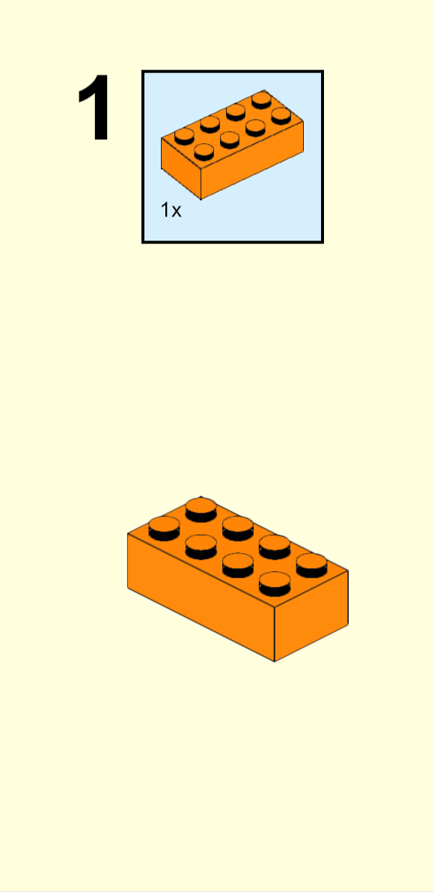
  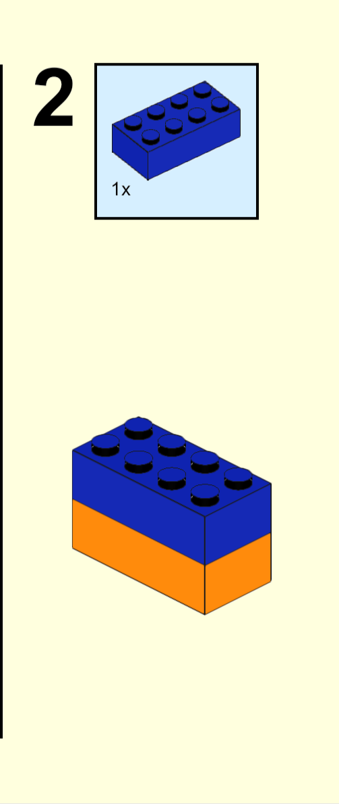
  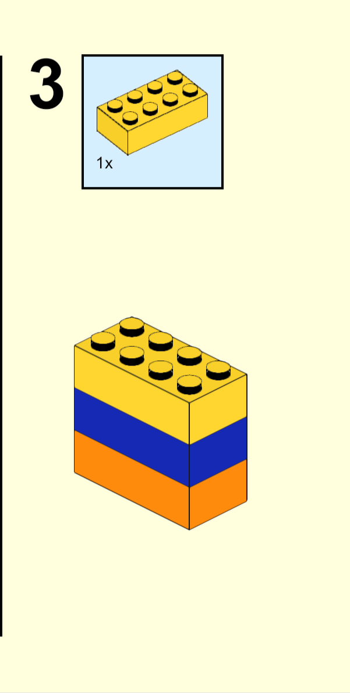
</div>

<!--
Une page web se compose de trois éléments basiques: du contenu HTML, un style en CSS et de l'interactivité avec Javascript (on peut se rappeler qu'à l'époque beaucoup de features de HTML/CSS ne sont pas implémentées et doivent être faites en JS)
-->

---
layout: two-cols-header
---

# {{ $page - 1 }} &nbsp;&nbsp;&nbsp;Java-SCRIPTS

::left::

<div class="h-full relative">
  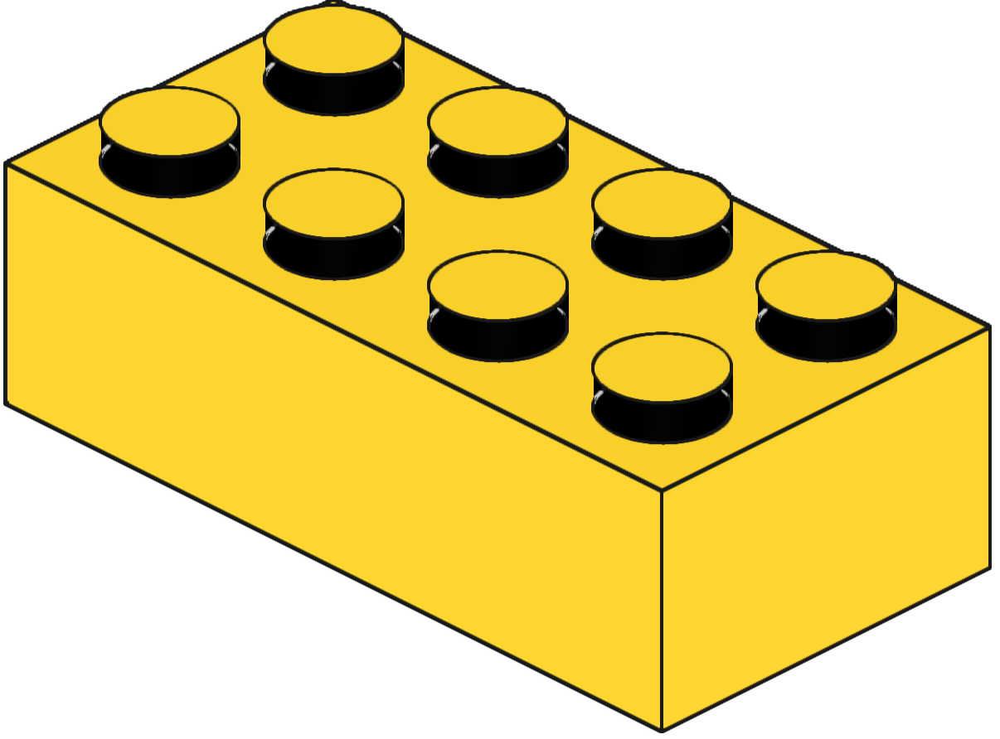
  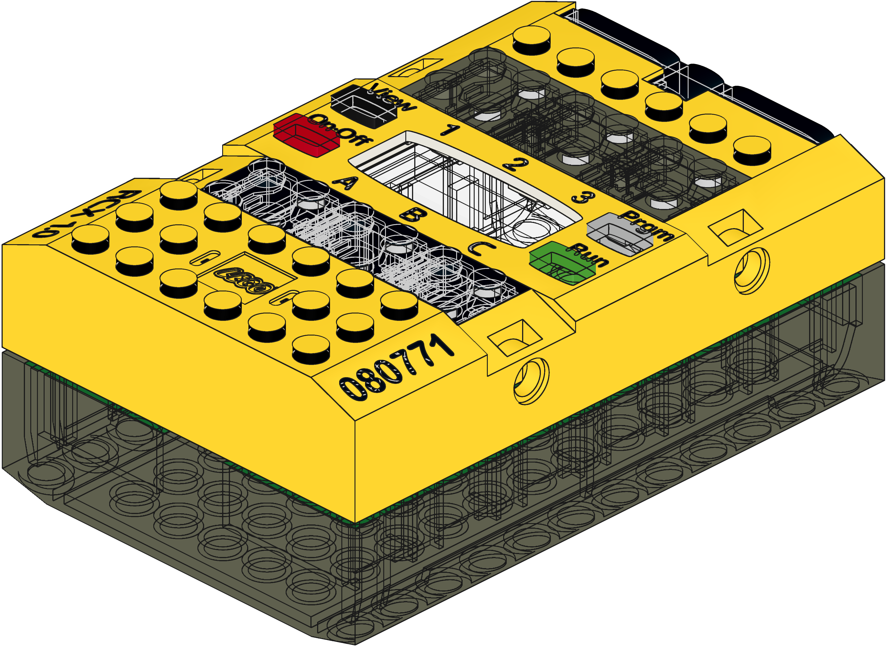
  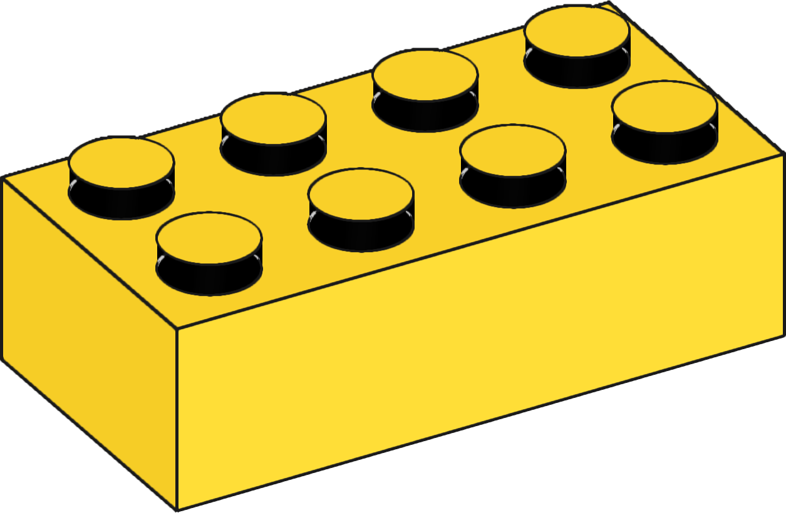
</div>

::right::

<div class="h-full relative">
<div v-click.hide="1" class="absolute inset-0 m-auto size-fit">
```html
<script src="myScript.js"></script>
```

</div>
<div v-click="[1, 2]" class="absolute inset-0 m-auto size-fit">
```html
<script src="myHugeScript.js"></script>
```

</div>
<div v-click="2" class="absolute inset-0 m-auto size-fit">
```html
<script src="utils.js"></script>
<script src="validation.js"></script>
<script src="ajax.js"></script>
<script src="main.js"></script>
```

</div>
</div>

<!-- Le code JS est intégré aux pages HTML via le tag script. Les développeurs ont le choix de tout mettre dans un seul script énorme ou de diviser en plusieurs scripts (donc autant de balises). (sans parler des scripts tiers qui fonctionnent exactement de la même manière). Script inline ou fichier dédié, c'est exactement la même chose. Insister sur le fait que c'est via le document HTML que le javascript est parsé et exécuté. C'est dans le contexte HTML (document, navigateur) que le javascript est exécuté et donc que les scripts peuvent interagir entre eux. A cette époque on fait peu de javascript donc c'est pas un problème -->

---
layout: two-cols-header
---

# {{ $page - 1 }} &nbsp;&nbsp;&nbsp;Scripts et modularité

<!-- TODO: faire une fiche avec des étapes 1/2 pour illustrer l'ordre de chargement de main.js et utils.js -->

::left::
<div class="h-full relative">
  
  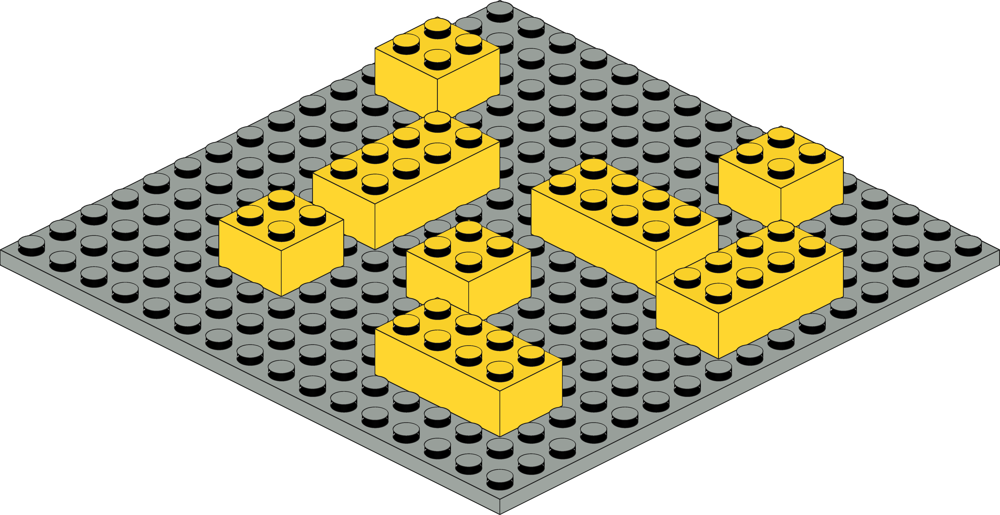
  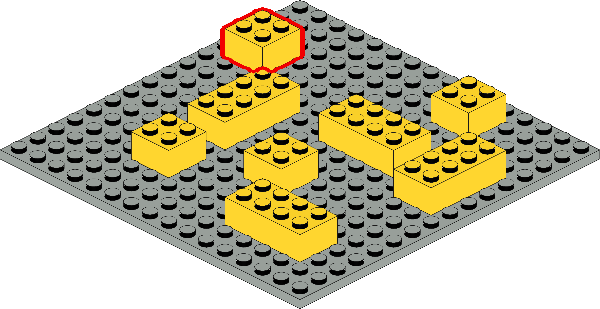
  
</div>

::right::

<div class="h-full relative">
<div v-click="[2, 3]" class="absolute inset-0 m-auto size-fit">
```html
<script src="utils.js"></script>
<script src="main.js"></script>
...
```

```js
// utils.js
function formatDate(date) {
  return date.toISOString().split('T')[0];
}

// main.js
console.log(formatDate(new Date()));
```

</div>
<div v-click="[3, 4]" class="absolute inset-0 m-auto size-fit">
```html
<script src="utils.js"></script>
```

</div>
<div v-click="4" class="absolute inset-0 m-auto size-fit">
```html
<script src="main.js"></script>
<script src="utils.js"></script>
...
```

```js
// main.js
console.log(formatDate(new Date()));
// Uncaught ReferenceError: formatDate is not defined

// utils.js
function formatDate(date) {
  return date.toISOString().split('T')[0];
}
```

</div>
</div>

<!-- Quand on combine des scripts: objet window global (dépendances implicites) et ordre de chargement qui compte, side effects et surtout collision car pas de namespace (t'es jamais sûr de pas écraser une variable définie ailleurs). En fait c'est comme tout concaténer dans un seul script -->

---
layout: two-cols-header
---

# {{ $page - 1 }} &nbsp;&nbsp;&nbsp; Namespacing et IIFEs

::left::
<div v-click="1" class="flex flex-col bg-[#ffffde] border border-black rounded-lg h-fit w-fit overflow-clip m-auto mt-10">
 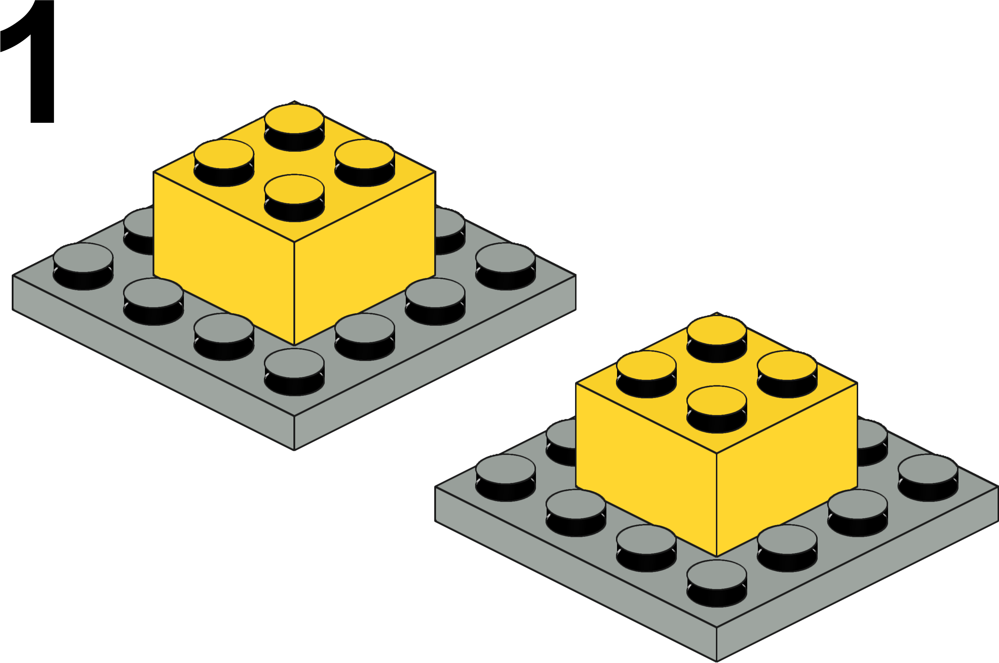
 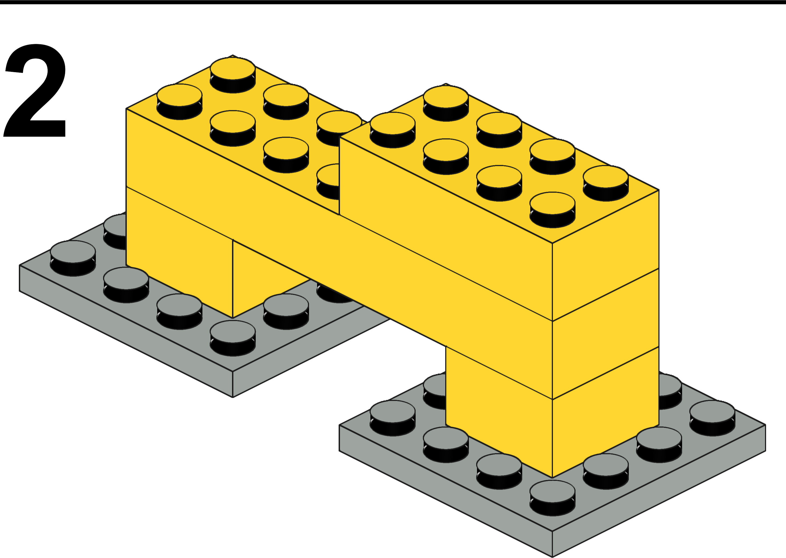
</div>

::right::

<div class="h-full relative">
<div v-click="1" class="absolute inset-0 m-auto mt-10 w-17/20">

```js
// utils.js
var MyApp = MyApp || {};

MyApp.utils = (function() {
  var myPrivateVar = {};

  return {
    formatDate: function(date) {
      return date.toISOString();
    }
  };
})();
```

</div>
<div v-click="2" class="absolute inset-0 m-auto mt-10 w-17/20">

```js
// utils.js
var MyApp = MyApp || {};

MyApp.utils = (function() {
  var myPrivateVar = {};

  return {
    formatDate: function(date) {
      return date.toISOString();
    }
  };
})();

// main.js
console.log(MyApp.utils.formatDate(new Date()));
```

</div>
</div>


<!-- Solution: des patterns émergent pour créer de la modularité en pratique: n'exposer que les parties dont on a besoin publiquement et garder les détails d'implémentation -->

---
layout: two-cols-header
---

# {{ $page - 1 }} &nbsp;&nbsp;&nbsp;De l'autre côté du miroir

::left::
<div class="h-full relative">
  
  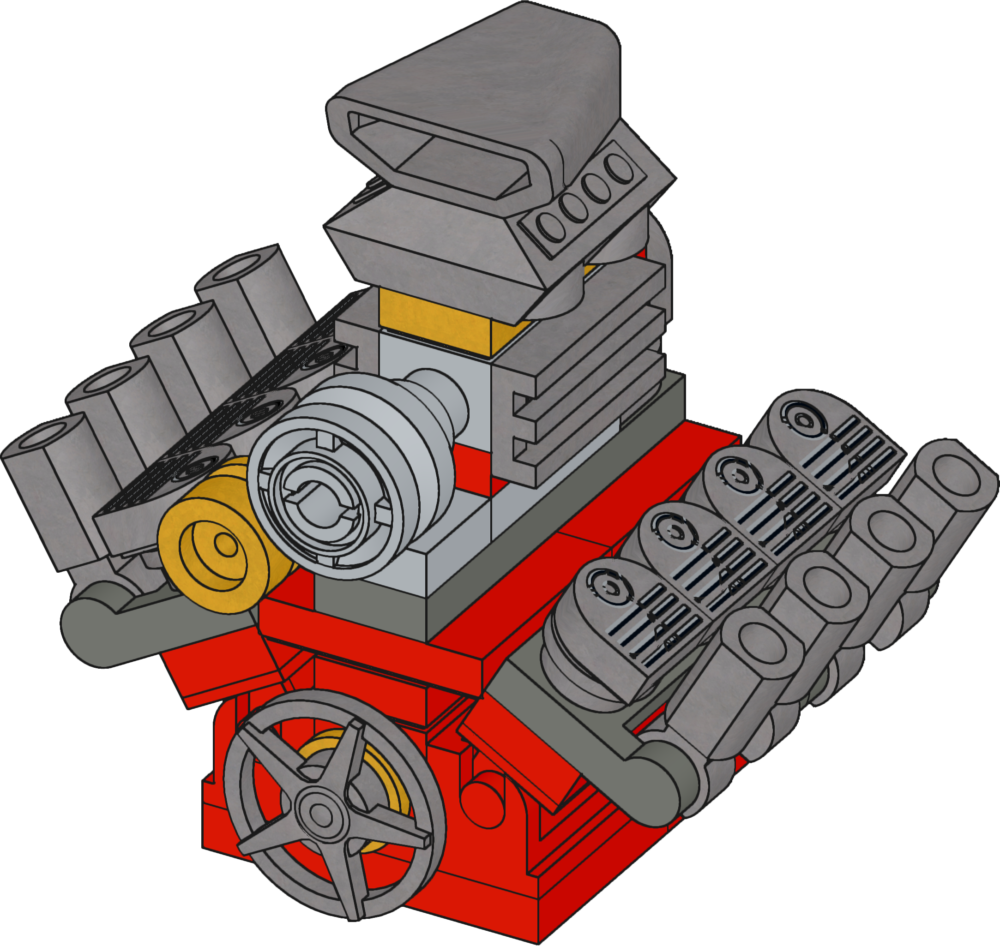
</div>

::right::

<div class="h-full relative">
  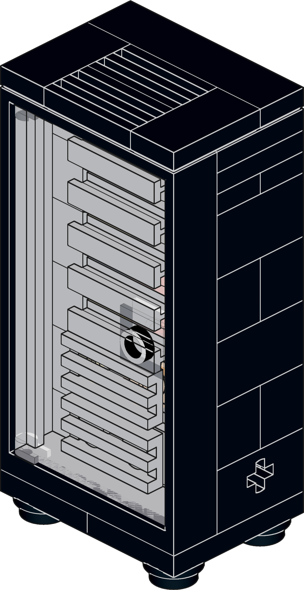
  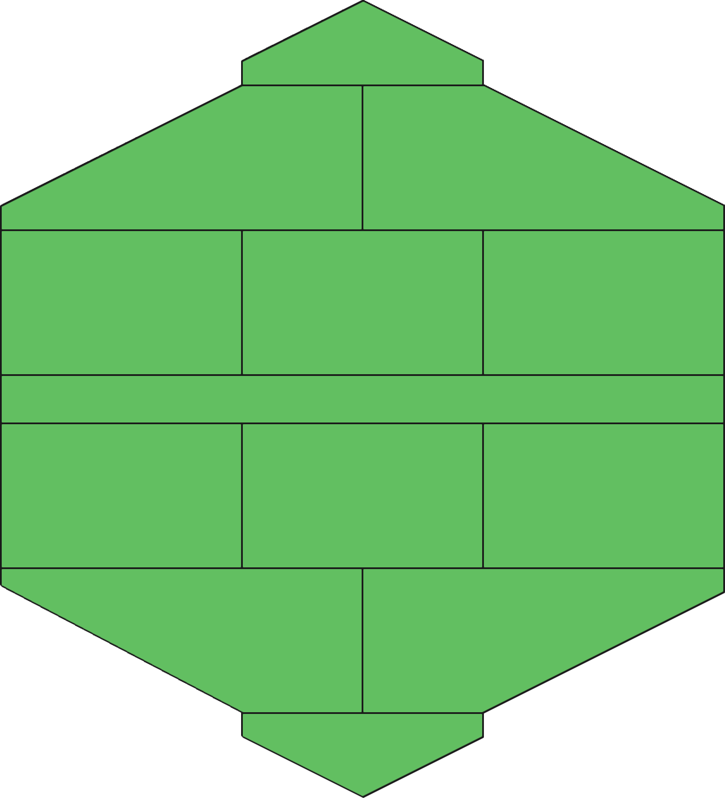
</div>

<!-- Bilan: Tout ce qu'on a vu, c'est le standard de fonctionnement de JS dans un navigateur, et ça fonctionnait. Mais à la fin des années 2000, Javascript va profondément se transformer en devenant un langage utilisable côté serveur (attention, il y a eu des runtimes serveurs depuis le milieu des années 90 (netscape) mais jamais vraiment d'essor.). Ce qui se passe à la fin des années 2000 de décisif: sortie de V8 en septembre 2008, un moteur JavaScript très performant, conçu pour être embeddable (pas lié à un navigateur) et open-source. Node sort en mai 2009, basé sur V8, wrapper autour de V8 avec de l'I/O asynchrone et une event loop. Donc fin des années 2000 - début des années 2010, on a une stack technique qui se met en place pour faire du JS côté serveur. -->

---
transition: fade
---

# {{ $page - 1 }} &nbsp;&nbsp;&nbsp;Un écosystème JavaScript côté-serveur ?

<div class="h-full grid place-items-center">
  
</div>

<!-- Fin des années 2000: moment d'effervescence autour de JavaScript. On a parlé des aspects techniques, mais ce n'est pas tout. Au même moment, va se mettre en place un vrai écosystème JavaScript serveur. Kevin Dangoor un développeur de Mozilla publie un post sur son blog qui va avoir un grand retentissement: il dit dedans que le JS côté serveur n'a pas tant besoin de solutions techniques (il y a en a plein qui existent déjà), mais d'un écosystème: une lib standard, des interfaces standard,  un certain nombre de conventions, un moyen unique et simple de publier et d'installer des dépendances en cross-platform, et... une méthode standard pour inclure des modules et les scoper proprement.-->

---
layout: quote
---

<div class="text-4xl/10">JavaScript needs a <span class="font-bold">standard way to include other modules</span> and for those modules to live in discreet namespaces. There are easy ways to do namespaces, but there’s no standard programmatic way to load a module (once!). This is really important, because server side apps can include a lot of code (...).</div>

<!-- Le JS côté serveur a vraiment besoin d'un système de modules car il y aura beaucoup plus de code avec un usage plus général. K Dangoor crée un groupe de discussion nommé ServerJS, qui sera renommé rapidement CommonJS. Attention CommonJS ne fait partie du TC39, elle ne définit pas une spécification officielle de JavaScript. Une spécification pour un système de module est rapidement établie et adoptée par NodeJS.-->

---
layout: two-cols-header
---

# {{ $page - 2 }} &nbsp;&nbsp;&nbsp; Les modules CommonJS

::left::

<div class="h-full relative">
  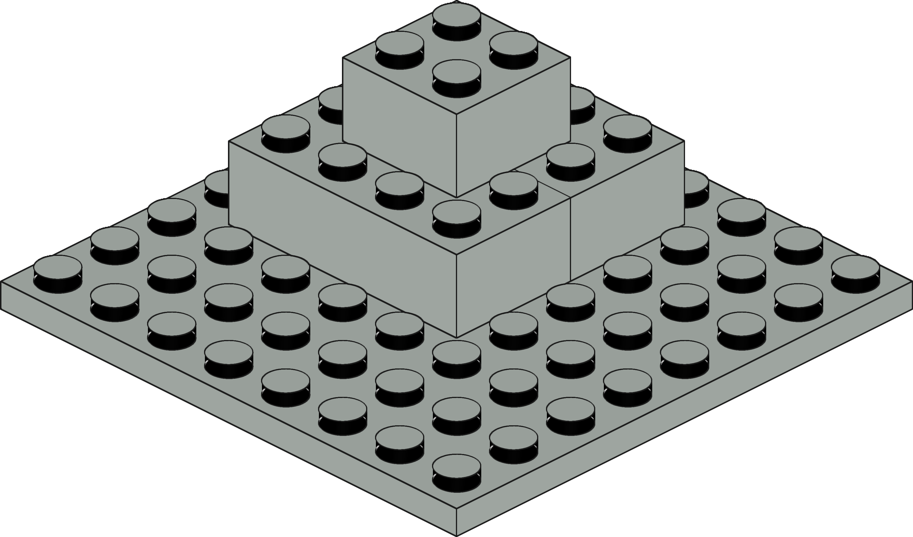
  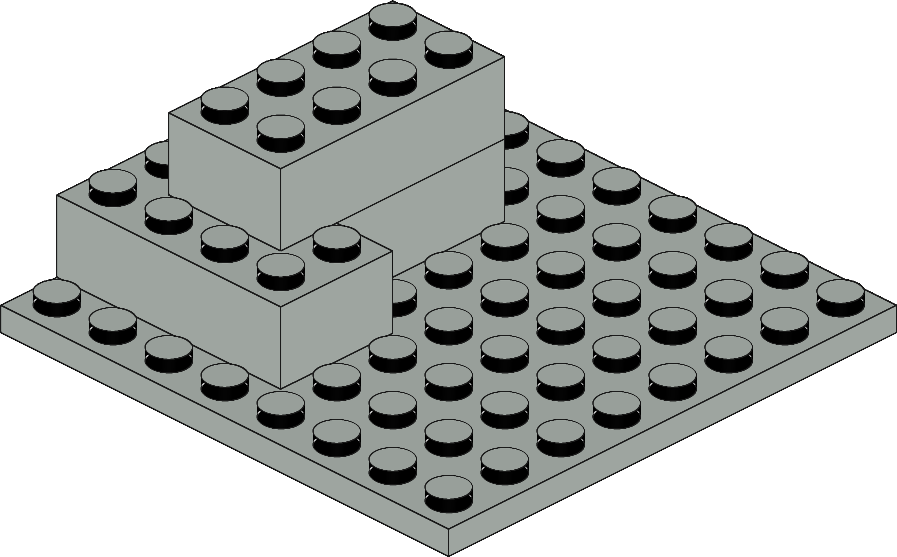
  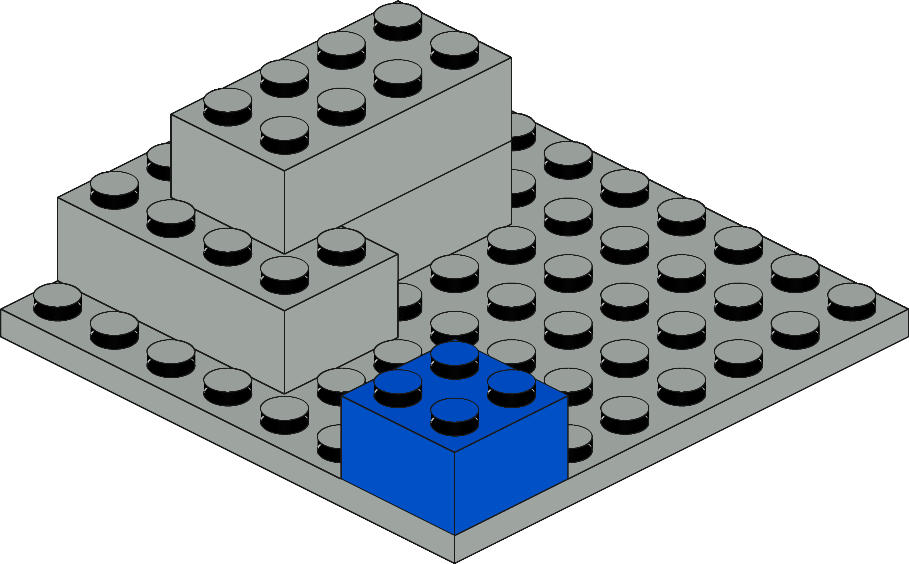
  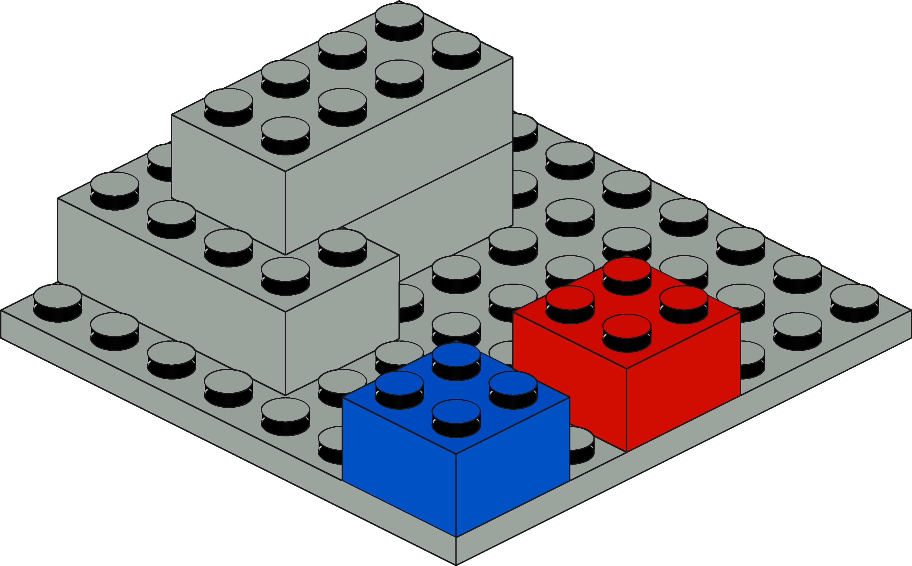
  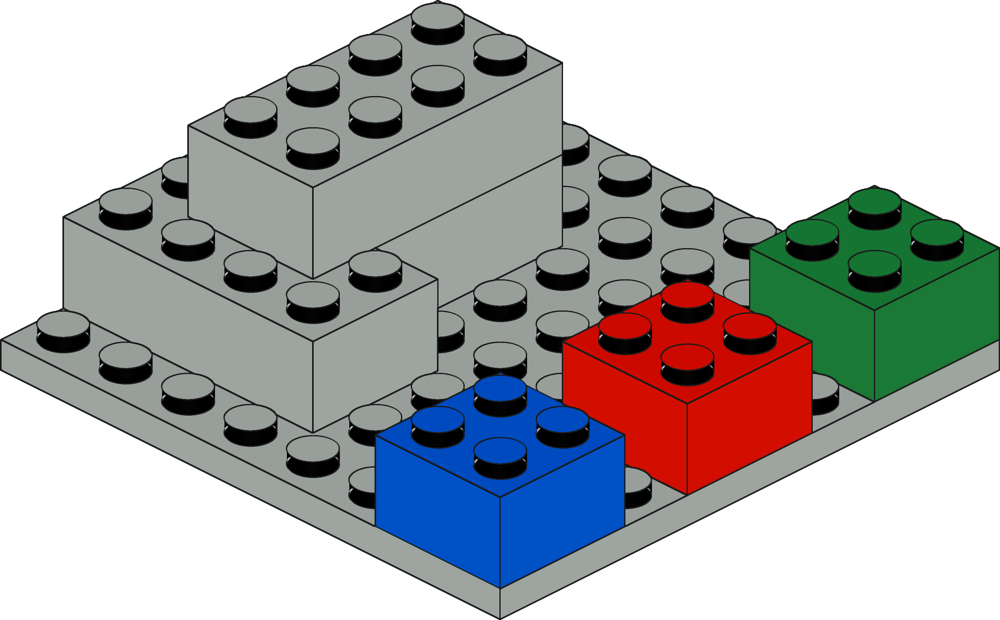
  
  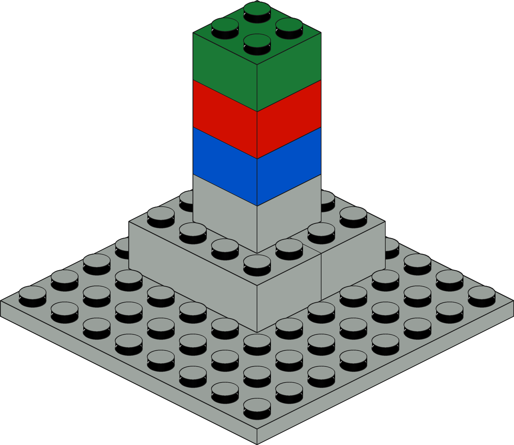
</div>

::right::

<div class="h-full relative">
<div v-click="[1, 2]" class="absolute top-0 left-1/2 -translate-x-1/2 w-17/20">

```js
// main.js
(...)
```

</div>
<div v-click="[2, 3]" class="absolute top-0 left-1/2 -translate-x-1/2 w-17/20">

```js
// main.js
(...)

var module = require('./module');
```

</div>
<div v-click="[3, 4]" class="absolute top-0 left-1/2 -translate-x-1/2 w-17/20">

```js
// module.js 
var private = "not exported";
console.log(private);
```

</div>
<div v-click="[4, 5]" class="absolute top-0 left-1/2 -translate-x-1/2 w-17/20">

```js
// module.js 
var private = "not exported";
console.log(private);
```

```
"not exported"
```

</div>
<div v-click="[5, 6]" class="absolute top-0 left-1/2 -translate-x-1/2 w-17/20">

```js
// module.js
var private = "not exported";
console.log(private);

exports.foo = "foo";
```

</div>
<div v-click="[6, 7]" class="absolute inset-0 m-auto size-fit w-17/20">

```js
// module.js
var private = "not exported";
console.log(private);

exports.foo = "foo";
exports.bar = "bar";
```

</div>
<div v-click="[7, 8]" class="absolute inset-0 m-auto size-fit w-17/20">

```js
// module.js
var private = "not exported";
console.log(private);

exports.foo = "foo";
exports.bar = "bar";
exports.baz = "baz";
```

</div>
<div v-click="[8, 9]" class="absolute inset-0 m-auto size-fit w-17/20">

```js
// main.js
(...)

var module = require('./module');
```

</div>
<div v-click="9" class="absolute inset-0 m-auto size-fit w-17/20">

```js
// main.js
(...)

var module = require('./module');

var foo = module.foo; // 'foo'
var bar = module.bar; // 'bar'
var baz = module.baz; // 'baz'
```

</div>
</div>


<!-- La spec définit de manière simple comment on exporte et importe des modules. Chaque module a accès à une fonction globale, require, qui prend en argument un identifiant de module et exécute le code du module pour obtenir son API exportée. Au moment où on exécute le require, les exports du module sont inconnus, il faut résoudre. Pour cela chaque module a un objet exports auquel on peut donner des propriétés (on ne peut pas le réassigner).

La spec est pensée pour le serveur: tous les fichiers sont sur le même filesystem donc le coût de chargement d'un module est négligeable. Modèle mental assez simple. On require, on exécute et on retourne les exports. Tout se fait au runtime, les imports et exports sont des instructions (appel de fonction et assignation à un objet). Architecture require-first.

Comme on exécute les modules pour définir leur imports, attention aux side-effects (mais ça peut être utile).
 -->

---
layout: two-cols-header
---

# {{ $page - 2 }} &nbsp;&nbsp;&nbsp;Dépendances circulaires

::left::

<div class="h-full relative">
<div v-click="[1, 4]" class="absolute inset-0 m-auto size-fit w-17/20">

```js
//a.js
var b = require('b.js');
```

</div>
<div v-click="[4, 5]" class="absolute inset-0 m-auto size-fit w-17/20">

```js
//a.js
exports.foo = "foo";

var b = require('b.js');
```

</div>
<div v-click="5" class="absolute inset-0 m-auto size-fit w-17/20">

```js
//a.js
exports.foo = "foo";

var b = require('b.js');

exports.bar = "bar";
```

</div>
</div>

::right::

<div class="h-full relative">
<div v-click="[1, 2]" class="absolute inset-0 m-auto size-fit w-17/20">

```js
//b.js
var a = require('a.js');
```

</div>
<div v-click="[2, 3]" class="absolute inset-0 m-auto size-fit w-17/20">

```js
//b.js
var a = require('a.js');

console.log(a.foo)
```

</div>
<div v-click="[3, 4]" class="absolute inset-0 m-auto size-fit w-17/20">

```js
//b.js
var a = require('a.js');

console.log(a.foo) // undefined
```

</div>
<div v-click="[4, 6]" class="absolute inset-0 m-auto size-fit w-17/20">

```js
//b.js
var a = require('a.js');

console.log(a.foo) // 'foo'
```

</div>
<div v-click="6" class="absolute inset-0 m-auto size-fit w-17/20">

```js
//b.js
var a = require('a.js');

console.log(a.foo) // 'foo'
console.log(a.bar) // undefined
```

</div>
</div>

<!-- Les dépendances circulaires sont gérées en utilisant la valeur d'exports au moment où la dépendance circulaire commence. C'est-à-dire que quand on require un module, s'il a déjà été (même partiellement !) exécuté, il n'est pas exécuté à nouveau mais on utilise la valeur de son objet exports (qui pourra changer si l'exécution reprend après la résolution des dépendances). 

Plusieurs conséquences: 
* Les dépendances circulaires fonctionnent
* Attention à l'ordre de chargement des modules qui change le résultat à l'exécution
* Il y a donc un cache de modules: chaque module est chargé une seule fois (au total, ça peut se faire en plusieurs fois si on est interrompu par un require). -->


---

# {{ $page - 2 }} &nbsp;&nbsp;&nbsp; De CommonJS à Node.js

<div class="h-full relative">
  
  
  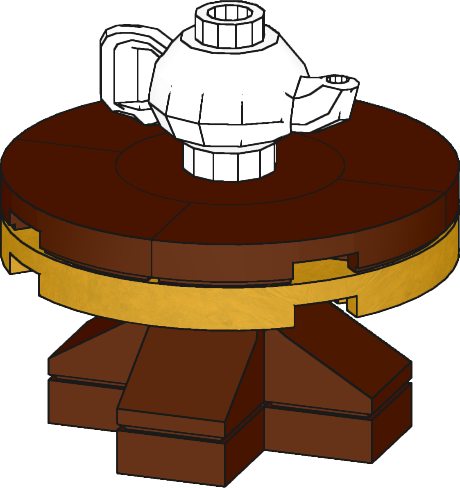
  
  
  
  
</div>

<!-- A cette période, Node.js n'est qu'un runtime JS serveur parmi d'autres (on a des outils il manquait un écosystème). Tous sont liés de près où de loin à CommonJS. Au début des années 2010, node devient le standard de facto du JS côté serveur et les alternatives ne décollent jamais (narwhal, ringoJS, v8cgi (teaJS), GPSEE). 

Ca créé des tensions dans la communauté (entre les contributeurs commonJS qui essayent d'élaborer une spec et n'implémentent rien et nodeJS). Le truc intéressant: node a implémenté les modules de commonJS, juste pas les autres trucs, mais Node est devenu le standard donc ça fait survivre les modules et on a oublié tout le reste de ce qui a été proposé par commonJS. Consensus: CommonJS était un projet trop ambitieux, mais ça a permis de faire node qui est devenu le standard côté serveur, donc un standard a bien émergé et tout le monde est content.  -->

---
layout: two-cols-header
---

# {{ $page - 2 }} &nbsp;&nbsp;&nbsp; Les modules Node.js: le module wrapper

::left::

<div class="h-full relative">
<div v-click="[1, 2]" class="absolute inset-0 m-auto size-fit">

```js
(function(exports, require, module, __filename, __dirname) {
// Module code actually lives in here
}); 
```

</div>
<div v-click="[2, 3]" class="absolute inset-0 m-auto size-fit w-25/20">

```js
//main.js

```

</div>
<div v-click="[3, 4]" class="absolute inset-0 m-auto size-fit w-25/20">

```js
//main.js
var nestedModule = require('./subfolder/nestedModule.js');
```

</div>
<div v-click="[4, 5]" class="absolute inset-0 m-auto size-fit w-25/20">

```js
//main.js
var nestedModule = require('./a/module.js');

console.log(nestedModule.require === require); // false

```

</div>
<div v-click="5" class="absolute inset-0 m-auto size-fit">

```js
//main.js
var nestedModule = require('./a/module.js');

console.log(nestedModule.require === require); // false

var sameLevelModule = nestedModule.require('./sameLevelModule.js');
// Error: Cannot find module './sameLevelModule.js'
```

</div>
</div>

::right::

<div class="h-full relative">
<div v-click="[2, 4]" class="absolute inset-0 m-auto size-fit">

```
.
├── main.js
├── sameLevelModule.js
└── subfolder/
    └── nestedModule.js
```

</div>
<div v-click="[4, 5]" class="absolute inset-0 m-auto size-fit">

```js
//nestedModule.js
exports.require = require;
```

</div>
<div v-click="5" class="absolute inset-0 m-auto size-fit">

```
.
├── main.js
├── sameLevelModule.js
└── subfolder/
    └── nestedModule.js
```

</div>
</div>

 <!-- Spécificités de l'implémentation de node. 
Module wrapper: à l'exécution, Node wrappe le module dans une fonction dans laquelle il injecte 5 paramètres, exports, require, module, __filename et __dirname. Ca permet d'avoir des variables "globales" (on ne les importe jamais manuellement) mais en fait propres à chaque module. Notamment la fonction require est unique pour chaque fonction
Objet module. -->

---
layout: two-cols-header
---

# {{ $page - 2 }} &nbsp;&nbsp;&nbsp; L'objet module

::left::

<div class="h-full relative">
  
  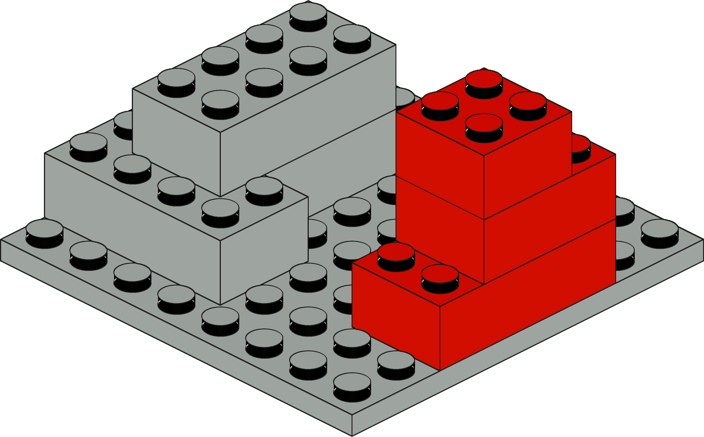
  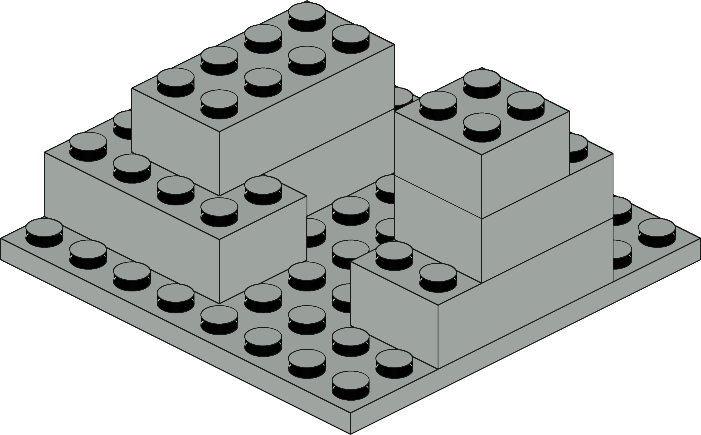
  
</div>

::right::

<div class="h-full relative">
<div v-click="[1, 2]" class="absolute top-0 left-1/2 -translate-x-1/2 w-17/20">

```js
// module.js
exports.foo = "foo";
exports.bar = "bar";
exports.baz = "baz";
```

</div>
<div v-click="[2, 4]" class="absolute top-0 left-1/2 -translate-x-1/2 w-17/20">

```js
// module.js
(...)

exports = new MyClass();
```

</div>
<div v-click="[4, 5]" class="absolute top-0 left-1/2 -translate-x-1/2 w-17/20">

```js
// main.js
var MyClass = require('./module.js'); // {}
```

</div>
<div v-click="5 " class="absolute top-0 left-1/2 -translate-x-1/2 w-17/20">

```js
// module.js
(...)

module.exports = new MyClass();
```

</div>
</div>

<!-- Jusqu'ici on a uniquement exporté via exports, comme d'après la spec CommonJS. Mais c'est pas la façon habituelle de faire, on utilise module.exports. Simple question d'assignation, si on veut retourner une seule valeur (genre une instance de classe), on ne peut pas réassigner l'objet exports (on change la référence, ça devient un objet local au module) -->

---
layout: two-cols-header
---

# {{ $page - 2 }} &nbsp;&nbsp;&nbsp; Manipulation de modules

::left::

<div class="h-full relative">
  
  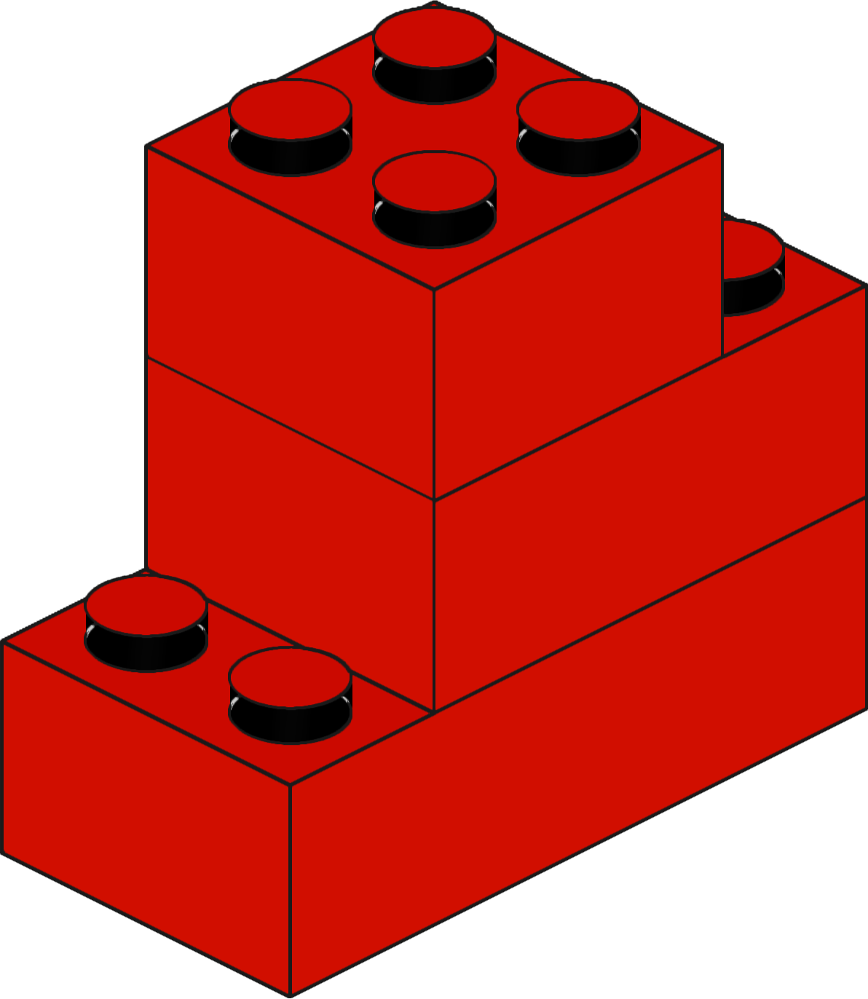
  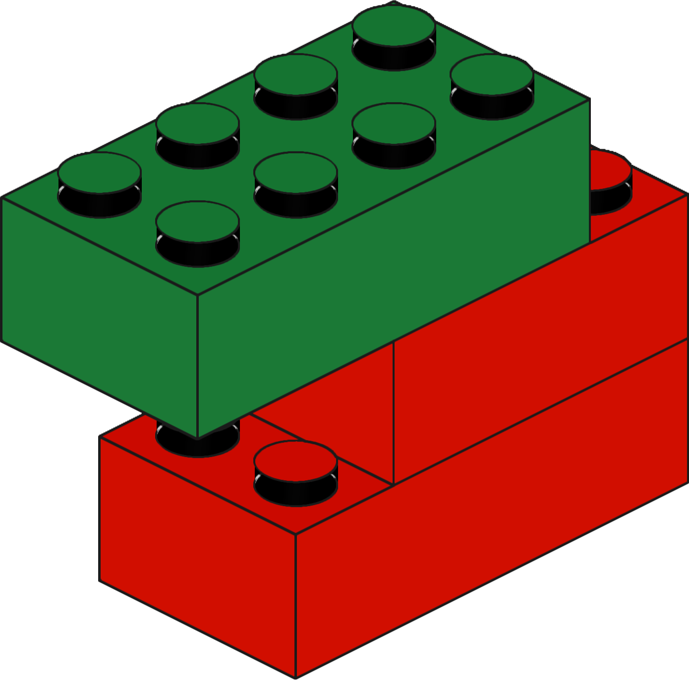
</div>

::right::

<div class="h-full relative">
<div v-click.hide="2" class="absolute top-0 left-1/2 -translate-x-1/2 w-17/20">

```js
// module.js
var foo = function () {
  console.log('foo');
}

exports.foo = foo;
```

</div>
<div v-click="[2, 3]" class="absolute top-0 left-1/2 -translate-x-1/2 w-17/20">

```js
// main.js
var module = require('./module.js');
var module2 = require('./module.js');
```

</div>
<div v-click="[3, 4]" class="absolute top-0 left-1/2 -translate-x-1/2 w-17/20">

```js
// main.js
var module = require('./module.js');
var module2 = require('./module.js');

console.log(module === module2); // true
```

</div>
<div v-click="[4, 5]" class="absolute top-0 left-1/2 -translate-x-1/2 w-17/20">

```js
// main.js
var module = require('./module.js');
module.foo(); // 'foo'

module.foo = function() {
  console.log('bar');
}
module.foo(); // 'bar'
```

</div>
<div v-click="5" class="absolute top-0 left-1/2 -translate-x-1/2 w-17/20">

```js
// main.js
var module = require('./module.js');
module.foo(); // 'foo'

module.foo = function() {
  console.log('bar');
}
module.foo(); // 'bar'

var module2 = require('./module.js');
module2.foo(); // 'bar'
```

</div>
</div>

<!-- Comme chaque module est instancié une seule fois, du coup un module peut en modifier un autre et la modification est active pour tous les autres consommateurs. -->

---

# {{ $page - 2 }} &nbsp;&nbsp;&nbsp; En résumé

<div class="absolute inset-0 m-auto w-3/4 h-fit pb-5 pt-10 border border-black rounded-md flex items-center justify-evenly z-1">
  <div class="absolute m-auto top-0">require()</div>
  <div class="absolute -z-1 flex items-center">
    <div class="w-200 h-10 bg-gray-500"></div>
    <div class="w-0 h-0 border-t-30 border-t-transparent border-l-30 border-l-gray-500 border-b-30 border-b-transparent"></div>
  </div>
  <div class="size-30 border border-black rounded-md p-3 grid place-items-center bg-#d3ecfd">Resolution</div>
  <div class="size-30 border border-black rounded-md p-3 grid place-items-center bg-#d3ecfd">Loading</div>
  <div class="size-30 border border-black rounded-md p-3 grid place-items-center bg-#d3ecfd">Wrapping</div>
  <div class="size-30 border border-black rounded-md p-3 grid place-items-center bg-#d3ecfd">Evaluation</div>
  <div class="size-30 border border-black rounded-md p-3 grid place-items-center bg-#d3ecfd">Caching</div>
  <div class="absolute -bottom-8 right-0 text-sm">credit: James M Snell</div>
</div>

<!-- TODO SLIDE Est-ce que ça a des influences côté-client ? AMD/require.js: modules asynchrones pour le navigateur. Browserify into Webpack. Naissance du bundling avec phases de build. -->

<!-- Résumé de ce qui se passe quand on importe un module en cjs dans node.-->

---

# {{ $page - 2 }} &nbsp;&nbsp;&nbsp; En résumé

<div class="h-full relative">
  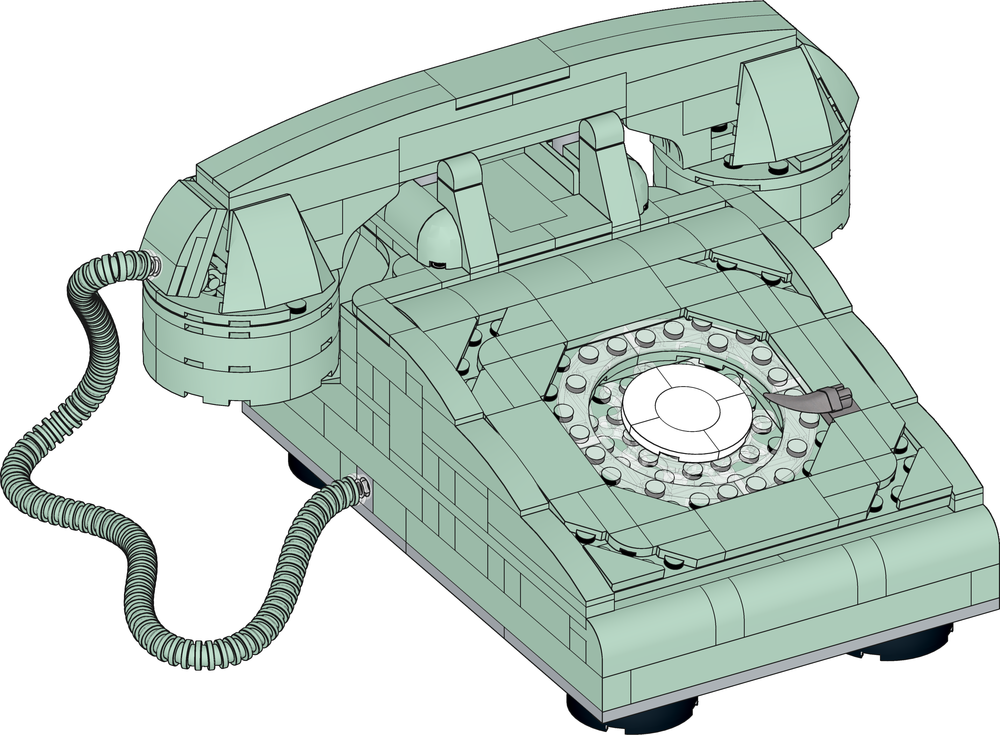
  
  
</div>

<!-- TODO: Imports dynamiques en CJS à partir de variables (en parler pour dire que c'est plus possible en ESM ?) -->

<!-- Recap CJS:
* Un système synchrone (chaque module est chargé quand il est requis) ou tout se fait au runtime (require est une fonction JS qu'on appelle, on ne connaît pas les exports à l'avance) 
* Un système pensé pour le serveur
* Implémentation par des runtimes, pas une feature de JS (wrapper les modules)
-->

---

# {{ $page - 2 }} &nbsp;&nbsp;&nbsp; Le trou noir ECMAScript des années 2000

<div class="h-full">
  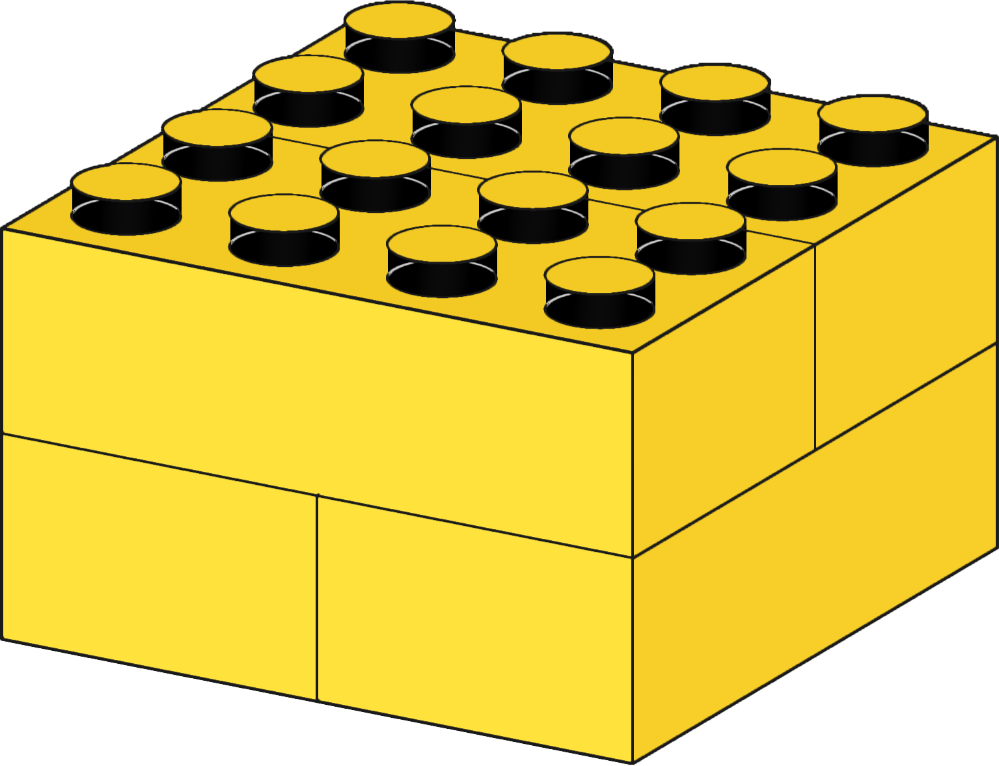
  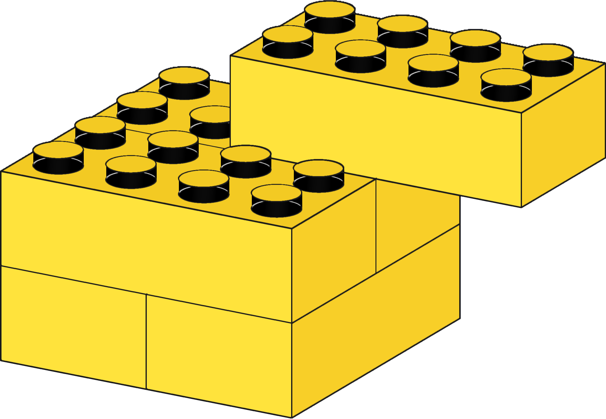
  
  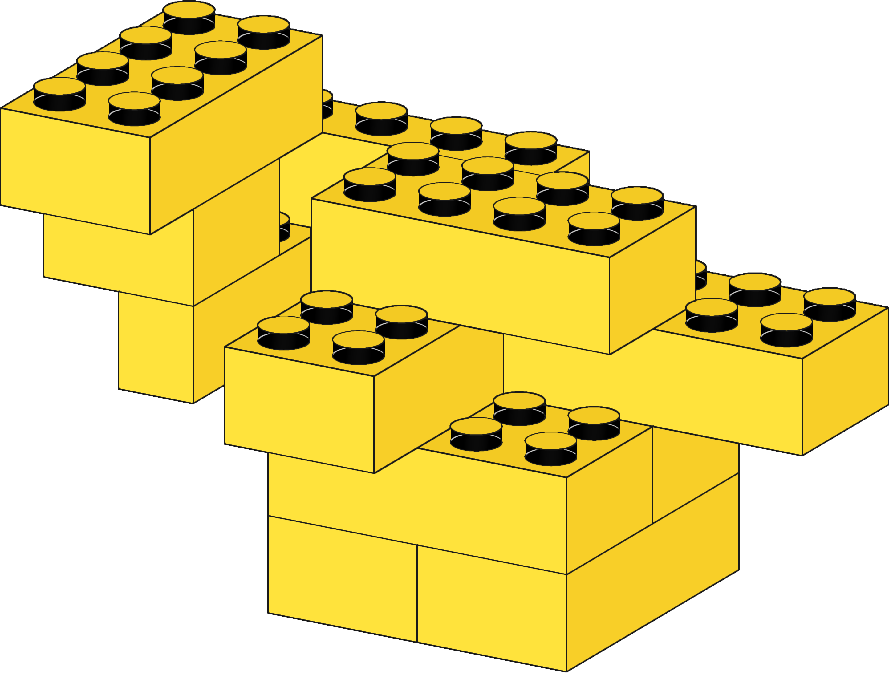
  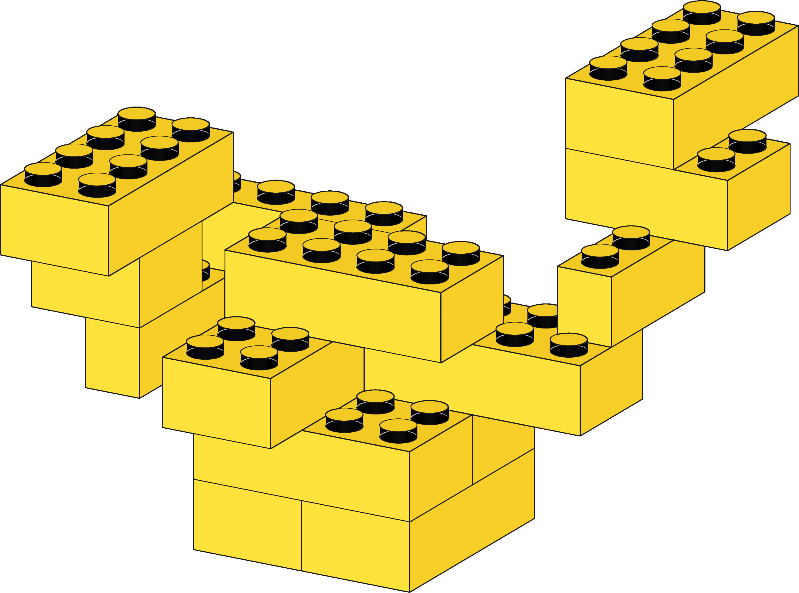
  
</div>

<!-- Pourquoi les modules sont pas dans la spec ? A la base JS est un petit langage de script, standarisé en ECMAScript. PB: dans les années 2000, aucune évolution du langage ou presque (projet de ES4 avec des packages (modules) beaucoup trop ambitieux bloqué par Microsoft). Aucune sortie majeure avant ES6 en 2015. Les modules sont dans ES6, moins ambitieux que les packages. -->

---

# {{ $page - 2 }} &nbsp;&nbsp;&nbsp; Le standard ESM

<div v-click="[1, 2]" class="absolute inset-0 w-full flex justify-evenly items-center">
  
  
</div>

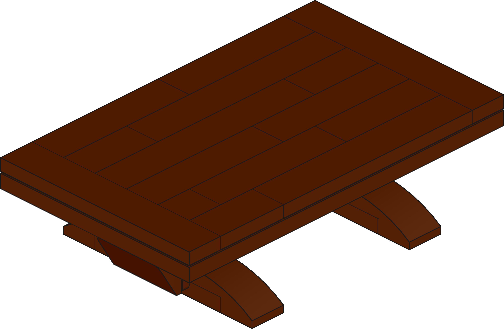

<div v-click="[3, 5]" class="absolute inset-0 w-full flex justify-evenly items-center">
  <div class="p-10">
    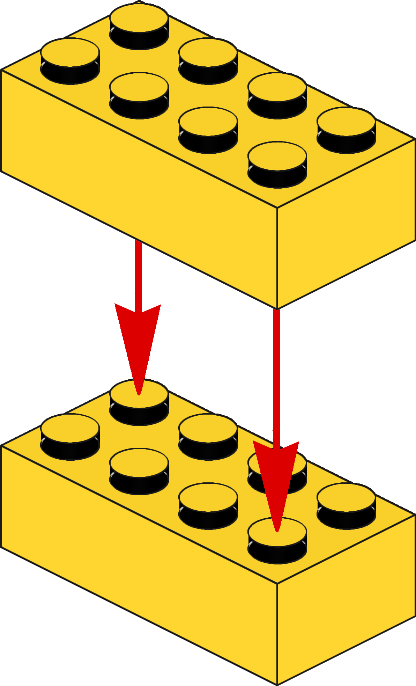
  </div>
  <div class="p-10">
    
  </div>
</div>

<div v-click="[5, 6]" class="absolute inset-0 w-full flex justify-evenly items-center">
  <div class="p-10 bg-green-100 outline outline-1 outline-black rounded-lg">
    
  </div>
  <div class="p-10">
    
  </div>
</div>

<div v-click="[6, 10]" class="absolute inset-0 w-full flex justify-evenly items-center">
  <div class="p-10 bg-green-100 outline outline-1 outline-black rounded-lg relative">
    
    
  </div>
  <div class="p-10 bg-red-100 outline outline-1 outline-black rounded-lg relative">
    
    
    
  </div>
</div>

<div v-click="10" class="absolute inset-0 w-full flex justify-evenly items-center">
  <div class="p-10 bg-green-100 outline outline-1 outline-black rounded-lg relative">
    
    
  </div>
  <div class="w-content"><code v-click="11" class="text-white">HostLoadImportedModule</code></div>
  <div class="p-10 bg-red-100 outline outline-1 outline-black rounded-lg relative">
    
    
    
  </div>
</div>

<!-- Histoire de la conception de ES6 -> des gens qui ont participé à CJS proposent des modules au TC39, ils collaborent. Problème: il faut faire une spec de modules universelle, et maintenant le server-side existe, ça ne peut pas être que une spec pour le navigateur, il faut accomoder les différents environnements d'exécution. Donc la spec se sépare en 2, une spec des ES modules pour JS (sémantique, construction des modules, lien, exécution: comment les modules fonctionnent) et le loader (résolution de module, fetching: d'où viennent les modules et comment les récupérer). Problème: la spec du loader est très difficile à écrire et devient le bottleneck pour la spec de modules qui existe -> Décision prise en 2014 de déléguer l'implémentation des modules à l'environnement, la spec ESM définit des opérations qui doivent être implémentées par l'environnement (résolution, loading). -->

---
layout: two-cols-header
---

# {{ $page - 2 }} &nbsp;&nbsp;&nbsp; Une nouvelle interface

::left::

<div class="h-full relative">
<div class="h-full relative">
<div v-click="[1, 2]" class="absolute top-0 left-1/2 -translate-x-1/2 w-18/20">

```js
import defaultExport from "module-name";
```
    
</div>
<div v-click="[2, 3]" class="absolute top-0 left-1/2 -translate-x-1/2 w-18/20">

```js
import defaultExport from "module-name";

import * as name from "module-name";
```
    
</div>
<div v-click="[3, 4]" class="absolute top-0 left-1/2 -translate-x-1/2 w-18/20">

```js
import defaultExport from "module-name";

import * as name from "module-name";

import { export1 } from "module-name";
```
    
</div>
<div v-click="[4, 5]" class="absolute top-0 left-1/2 -translate-x-1/2 w-18/20">

```js
import defaultExport from "module-name";

import * as name from "module-name";

import { export1 } from "module-name";

import { export1 as alias1 } from "module-name";
```
    
</div>
<div v-click="[5, 6]" class="absolute top-0 left-1/2 -translate-x-1/2 w-18/20">

```js
import defaultExport from "module-name";

import * as name from "module-name";

import { export1 } from "module-name";

import { export1 as alias1 } from "module-name";
```
    
</div>
<div v-click="[6, 7]" class="absolute top-0 left-1/2 -translate-x-1/2 w-18/20">

```js
import defaultExport from "module-name";

import * as name from "module-name";

import { export1 } from "module-name";

import { export1 as alias1 } from "module-name";

import { default as alias } from "module-name";
```
    
</div>
<div v-click="[7, 8]" class="absolute top-0 left-1/2 -translate-x-1/2 w-18/20">

```js
import defaultExport from "module-name";

import * as name from "module-name";

import { export1 } from "module-name";

import { export1 as alias1 } from "module-name";

import { default as alias } from "module-name";

import { export1, export2 } from "module-name";
```
    
</div>
<div v-click="[8, 9]" class="absolute top-0 left-1/2 -translate-x-1/2 w-18/20">

```js
import defaultExport from "module-name";

import * as name from "module-name";

import { export1 } from "module-name";

import { export1 as alias1 } from "module-name";

import { default as alias } from "module-name";

import { export1, export2 } from "module-name";

import { "string name" as alias } from "module-name";
```
    
</div>
<div v-click="[9, 10]" class="absolute top-0 left-1/2 -translate-x-1/2 w-18/20">

```js
import defaultExport from "module-name";

import * as name from "module-name";

import { export1 } from "module-name";

import { export1 as alias1 } from "module-name";

import { default as alias } from "module-name";

import { export1, export2 } from "module-name";

import { "string name" as alias } from "module-name";

import defaultExport, { export1 } from "module-name";
```
    
</div>
<div v-click="[10, 11]" class="absolute top-0 left-1/2 -translate-x-1/2 w-18/20">

```js
import defaultExport from "module-name";

import * as name from "module-name";

import { export1 } from "module-name";

import { export1 as alias1 } from "module-name";

import { default as alias } from "module-name";

import { export1, export2 } from "module-name";

import { "string name" as alias } from "module-name";

import defaultExport, { export1 } from "module-name";

import defaultExport, * as name from "module-name";
```
    
</div>
<div v-click="11" class="absolute top-0 left-1/2 -translate-x-1/2 w-18/20">

```js
import defaultExport from "module-name";

import * as name from "module-name";

import { export1 } from "module-name";

import { export1 as alias1 } from "module-name";

import { default as alias } from "module-name";

import { export1, export2 } from "module-name";

import { "string name" as alias } from "module-name";

import defaultExport, { export1 } from "module-name";

import defaultExport, * as name from "module-name";

import "module-name";
```
    
</div>
</div>
</div>

::right::

<div class="h-full relative">
<div class="h-full relative">
<div v-click="[12, 13]" class="absolute top-0 left-1/2 -translate-x-1/2 w-18/20">

```js
export const name1 = 1, name2 = 2/*, … */;
```
    
</div>
<div v-click="[13, 14]" class="absolute top-0 left-1/2 -translate-x-1/2 w-18/20">

```js
export const name1 = 1, name2 = 2/*, … */;

export { name1, /* …, */ nameN };
```
    
</div>
<div v-click="[14, 15]" class="absolute top-0 left-1/2 -translate-x-1/2 w-18/20">

```js
export const name1 = 1, name2 = 2/*, … */;

export { name1, /* …, */ nameN };

export { variable1 as name1, variable2 as name2 };
```
    
</div>
<div v-click="[15, 16]" class="absolute top-0 left-1/2 -translate-x-1/2 w-18/20">

```js
export const name1 = 1, name2 = 2/*, … */;

export { name1, /* …, */ nameN };

export { variable1 as name1, variable2 as name2 };

export { variable1 as "string name" };
```
    
</div>
<div v-click="[16, 17]" class="absolute top-0 left-1/2 -translate-x-1/2 w-18/20">

```js
export const name1 = 1, name2 = 2/*, … */;

export { name1, /* …, */ nameN };

export { variable1 as name1, variable2 as name2 };

export { variable1 as "string name" };

export { name1 as default /*, … */ };
```
    
</div>
<div v-click="[17, 18]" class="absolute top-0 left-1/2 -translate-x-1/2 w-18/20">

```js
export const name1 = 1, name2 = 2/*, … */;

export { name1, /* …, */ nameN };

export { variable1 as name1, variable2 as name2 };

export { variable1 as "string name" };

export { name1 as default /*, … */ };

export default expression;
```
    
</div>
<div v-click="[18, 19]" class="absolute top-0 left-1/2 -translate-x-1/2 w-18/20">

```js
export const name1 = 1, name2 = 2/*, … */;

export { name1, /* …, */ nameN };

export { variable1 as name1, variable2 as name2 };

export { variable1 as "string name" };

export { name1 as default /*, … */ };

export default expression;

export default function functionName() { /* … */ }
```
    
</div>
<div v-click="19" class="absolute top-0 left-1/2 -translate-x-1/2 w-18/20">

```js
export const name1 = 1, name2 = 2/*, … */;

export { name1, /* …, */ nameN };

export { variable1 as name1, variable2 as name2 };

export { variable1 as "string name" };

export { name1 as default /*, … */ };

export default expression;

export default function functionName() { /* … */ }

export * from "module-name";
```
    
</div>
</div>
</div>

<!-- Présentation de l'interface, statement et fonction import. Insister sur le statement, toujours top level, analysable de manière statique. Pas du tout utilisé lors de l'exécution d'un fichier mais uniquement lors d'une phase de construction des modules.
* Imports:
Default (une seule valeur, équivalent module.exports)
Namespace (équivalent exports.foo)
Named (possibilité de rename)
Rename le default (pareil que de direct renommer le défault): intéressant, ça veut dire que l'export default n'a rien de spécial, il a juste le nom défault
Plusieurs exports named (ressemble à de la destructuration mais pas vraiment)
Imports strings (obligé de rennomer)
Identifiants arbitraires (parce que WASM génère des exports en unicode qui ne sont pas forcément des identifiants (espaces, tirets, etc.))
Combinaison de default + named
Combinaison de default + namespace (namespace + named impossible)
Import de side-effect (juste faire tourner le top-level code)

* Exports:
Nommés (déclaration de variable, constante, fonction, classe)
Nommés de valeurs déjà déclarées
Renommage possible
Identifiants arbitraires (toutes valeurs possibles)
Exporter une valeur comme défaut (juste un nom)
Export par défaut (n'importe quelle expression ou déclaration de fonction/classe (mais pas de statement))
Re-export (namespace, named, default)

 -->

---

# {{ $page - 2 }} &nbsp;&nbsp;&nbsp; Comment charger un module ?

<div v-click="2" class="flex bg-[#ffffde] border border-black rounded-lg w-fit h-sm overflow-clip m-auto mt-10 items-center p-5">
  <div v-click="2" class="max-h-80 p-8 py-10 pt-12 relative">
    <span class="absolute top-0 left-8 text-3xl">1</span>
    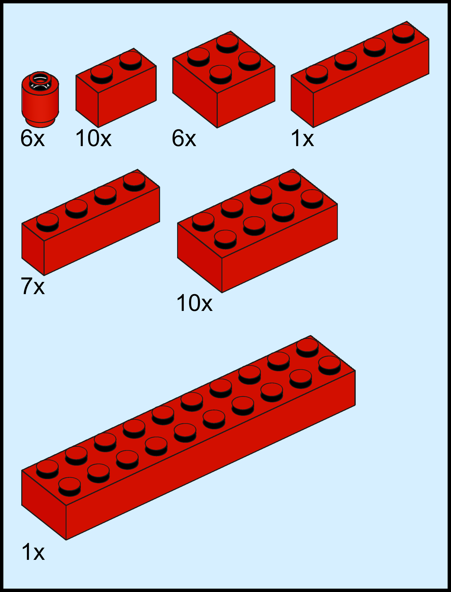
  </div>
  <div v-click="3" class="max-h-80 p-10 px-15 border-l border-black relative">
    <span class="absolute top-0 left-8 text-3xl">2</span>
    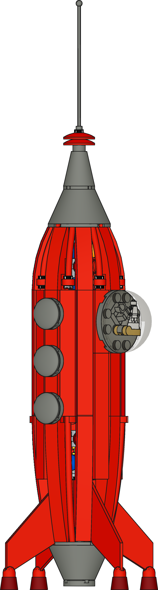
  </div>
  <div v-click="4" class="max-h-80 px-10 border-l border-black relative">
    <span class="absolute top-0 left-8 text-3xl">3</span>
    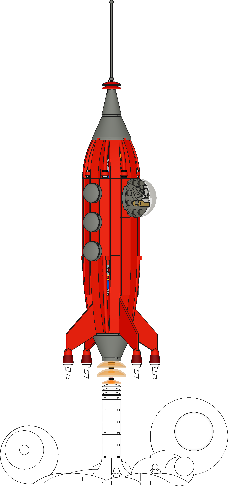
  </div>
</div>

<!-- Présentation des 3 phases asynchrones: construction: trouver les modules, les télécharger et les parser en module records, équivalent de récupérer toutes les pièces nécessaires pour un lego, instantiation: réserver de l'espace mémoire pour les imports/exports (linking) équivalent d'assembler les pièces mais on ne les fait pas encore fonctionner, evaluation: exécution du code pour remplir l'espace mémoire avec des valeurs, fonctionnement de l'objet. Asynchrone pour le navigateur -->

---
layout: two-cols-header
---

# {{ $page - 2 }} &nbsp;&nbsp;&nbsp; Construction

::left::

<div class="h-full relative">
  
  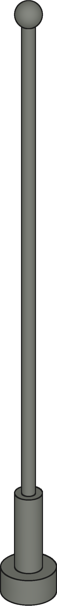
  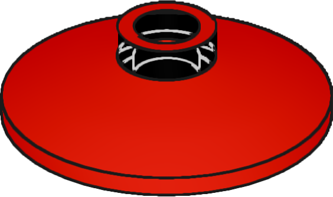
  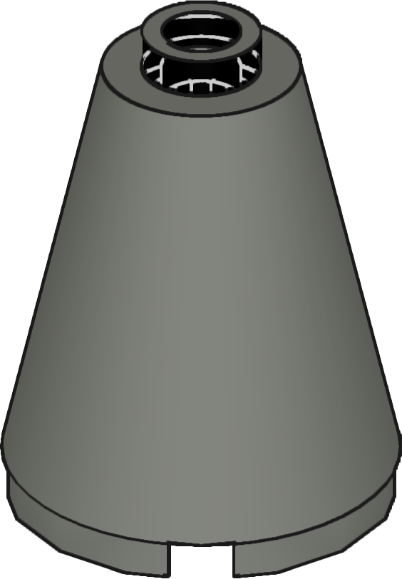
  
</div>

::right::

<div class="h-full relative">
<div v-click="[2, 3]" class="absolute top-0 left-1/2 -translate-x-1/2 w-17/20">

```html
<script src="main.js" type="module">
```

</div>
<div v-click="[3, 4]" class="absolute top-0 left-1/2 -translate-x-1/2 w-17/20">

```js
// main.js
import { something } from "module.js"

...
```

</div>
<div v-click="[4, 5]" class="absolute top-0 left-1/2 -translate-x-1/2 w-17/20">

```js
// module.js
import { somethingElse } from "anotherModule.js"

...
```

</div>
<div v-click="5" class="absolute top-0 left-1/2 -translate-x-1/2 w-17/20">

```js
// anotherModule.js
import { anotherThing } from "otherModule.js"

...
```

</div>
</div>


<!-- TODO Rajouter une partie sur la résolution -->

<!-- Construction de l'arbre des modules. Comment on passe d'un point d'entrée à un arbre de module records. Parler des différences avec CJS, asynchrone parce que on fait toute la construction d'un coup, on évalue pas chaque module puis on fait l'import à la volée, on va d'abord résoudre tous les imports: avant l'exécution du moindre module, le moteur connaît tout l'arbre de dépendances. C'est asynchrone donc le main thread n'est pas bloqué: on peut fetch les modules découverts en parallèle et la page répond toujours. Première phase: résolution, le moteur trouve une déclaration d'import, il délègue la résolution au loader qui va fetcher dans la foulée (en http ou dans le filesystem) le moteur reçoit le code source (non évalué) et va le parser (pas l'exécuter) pour créer un module record. C'est une représentation du module qui contient le code mais aussi les imports/exports. Les modules sont placés dans une import map (un cache) -->

---
layout: two-cols-header
---

# {{ $page - 2 }} &nbsp;&nbsp;&nbsp; Instanciation

::left::

<div class="h-full relative">
  
  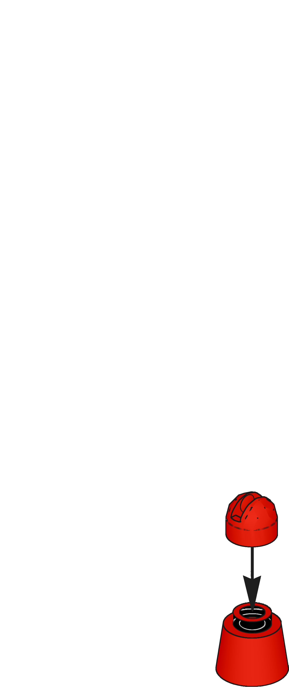
  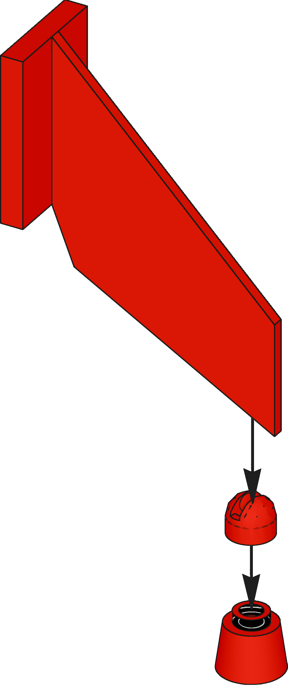
  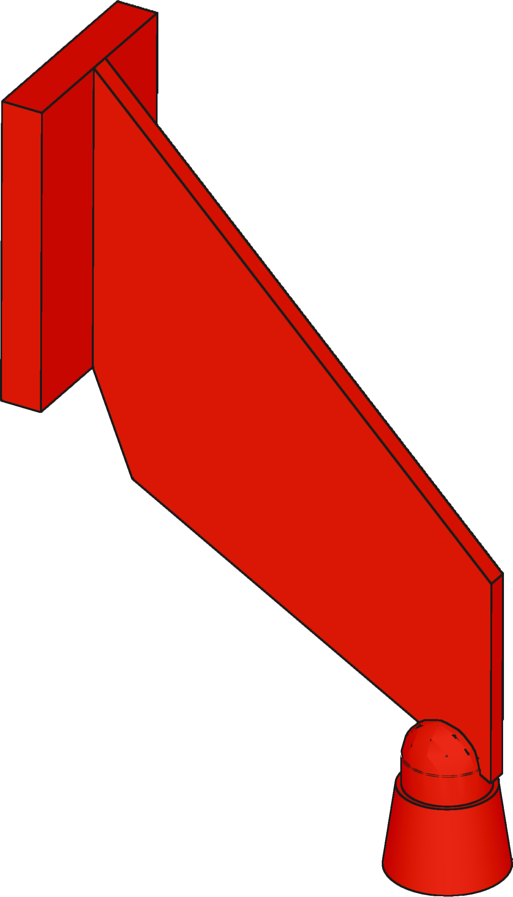
  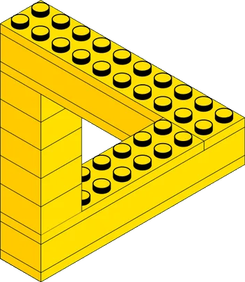
</div>

::right::

<div class="h-full relative">
<div v-click="[1, 2]" class="absolute top-0 left-1/2 -translate-x-1/2 w-17/20">

```js
// module.js

// no imports !

... // no code is evaluated yet

export const foo = "foo";
```

</div>
<div v-click="[2, 3]" class="absolute top-0 left-1/2 -translate-x-1/2 w-17/20">

```js
// parent.js
import { foo } from "./module.js"

...

export const bar = "bar";
```

</div>
<div v-click="[3, 4]" class="absolute top-0 left-1/2 -translate-x-1/2 w-17/20">

```js
// grandParent.js
import { bar } from "./parent.js"

...

export const baz = "baz";
```

</div>
<div v-click="[4, 5]" class="absolute top-0 left-1/2 -translate-x-1/2 w-17/20">

```js
// module.js
export let count = 0;
export function increment() { count++ }
```

</div>
<div v-click="[5, 6]" class="absolute top-0 left-1/2 -translate-x-1/2 w-17/20">

```js
// module.js
export let count = 0;
export function increment() { count++ }
```

```js
// main.js
import { count, increment } from './module.js';

console.log(count); // 0
increment();
console.log(count); // 1
```

</div>
<div v-click="6" class="absolute top-0 left-1/2 -translate-x-1/2 w-17/20">

```js
// a.js
import { value } from './b.js';
export const value = 'a';
export const getValue = () => value;
```
<div v-click="7">
```js
// b.js
import { value } from './a.js';
export const value = 'b';
export const getValue = () => value;
```
</div>

<div v-click="8">
```js
// main.js
import { getValue as getA } from './a.js';
import { getValue as getB } from './b.js';
console.log(getA()); // 'b'
console.log(getB()); // 'a'
```
</div>

</div>
</div>

<!-- Phase de linking: réserver des espaces mémoire pour les objets qui sont importés/exportés, les espaces mémoires ne sont pas remplis à ce moment-là (il faudrait exécuter le code). Live bindings: l'import et l'export pointent sur le même espace mémoire, on ne peut pas réassigner un import. Ca permet de gérer les dépendances cycliques et de créer un arbre sans exécuter aucun code (en cjs puisqu'on copie les valeurs il faut bien connaître les valeurs). Les modules sont instanciés par le moteur.-->

---

# {{ $page - 2 }} &nbsp;&nbsp;&nbsp; Evaluation


<!-- Phase d'évaluation, le code est évalué dans l'ordre inverse (on part des feuilles de l'arbre, les modules qui n'ont pas de dépendance) et on exécute le code de top-niveau. On remplit les espaces mémoire avec les valeurs.-->

---

# {{ $page - 2 }} &nbsp;&nbsp;&nbsp; Pourquoi c'est mieux ?

<div class="h-full relative">
  
  
  
  
  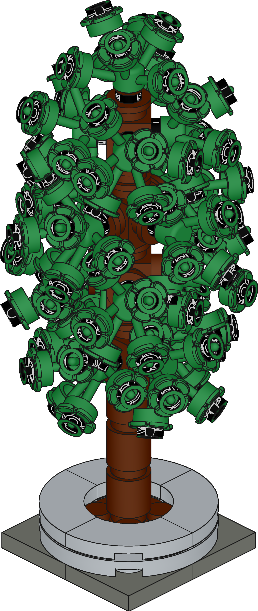
</div>

<!-- 
Dans le langage directement
Supporté par les navigateurs
Asynchrone
Meilleur support des dépendances circulaires
Static: analysable, tree-shakeable
-->

---
layout: two-cols-header
---

# {{ $page - 2 }} &nbsp;&nbsp;&nbsp; Parse goals

::left::

<div class="h-full relative">
<div v-click="[1, 3]" class="absolute top-0 left-1/2 -translate-x-1/2 w-18/20">

```html
<script>
  undefinedVariable = "foo" // no error
</script>
```

</div>
<div v-click="[3, 5]" class="absolute top-0 left-1/2 -translate-x-1/2 w-18/20">

```html
<script>
  undefinedVariable = "foo" // no error

  var global = "global"
  console.log(window.global) // "global"
</script>
```

</div>
<div v-click="[5, 7]" class="absolute top-0 left-1/2 -translate-x-1/2 w-18/20">

```html
<script>
  undefinedVariable = "foo" // no error

  var global = "global"
  console.log(window.global) // "global"

  const data = await fetch('...'); // error
</script>
```

</div>

</div>

::right::

<div class="h-full relative">
<div v-click="[2, 4]" class="absolute top-0 left-1/2 -translate-x-1/2 w-18/20">

```html
<script type="module">
  undefinedVariable = "foo" // error
</script>
```

</div>
<div v-click="[4, 6]" class="absolute top-0 left-1/2 -translate-x-1/2 w-18/20">

```html
<script type="module">
  undefinedVariable = "foo" // error

  var global = "global"
  console.log(window.global) // undefined
</script>
```

</div>
<div v-click="[6, 7]" class="absolute top-0 left-1/2 -translate-x-1/2 w-18/20">

```html
<script type="module">
  undefinedVariable = "foo" // error

  var global = "global"
  console.log(window.global) // undefined

  const data = await fetch('...'); // 👌
</script>
```

</div>
<span v-click="[7, 8]" class="text-9xl absolute inset-0 m-auto w-fit h-fit">?</span>
<div v-click="8" class="absolute top-0 left-1/2 -translate-x-1/2 w-18/20">
<div v-click="8" class="w-18/20">

```js
// module.mjs
```

</div>
<div v-click="9" class="w-18/20">

```json
// package.json
{
  type: "module"
}
```

</div>
<div v-click="10" class="w-18/20">

```js
// module.js
import something from "otherModule.js"
```

</div>

</div>
</div>

<!-- Module comme parse goal: use strict, await. Parler de type module comme quelque chose de fondamentalement différent d'un script. Ca marche pour le navigateur mais pas pour node, d'où le mjs. Parler de comment Node comprend qu'un fichier est un module.-->

---
layout: two-cols-header
---

# {{ $page - 2 }} &nbsp;&nbsp;&nbsp; Interopérabilité

::left::

<div class="h-full relative">
<div v-click="1" class="absolute top-0 left-1/2 -translate-x-1/2 w-18/20">

```js
// module.mjs
import foo from "module.cjs"
```

</div>
</div>

::right::

<div class="h-full relative">
<div v-click="[2, 3]" class="absolute top-0 left-1/2 -translate-x-1/2 w-18/20">

```js
// module.cjs
const foo = require('module.mjs');
```

</div>
<div v-click="[3, 4]" class="absolute top-0 left-1/2 -translate-x-1/2 w-18/20">

```js
// module.cjs
const foo = require('module.mjs');
```

```js
// module.mjs
export default "foo";
```

</div>
<div v-click="[4, 5]" class="absolute top-0 left-1/2 -translate-x-1/2 w-18/20">

```js
// module.cjs
const foo = require('module.mjs');

console.log(foo); // { default: "foo" }
```

```js
// module.mjs
export default "foo";
```

</div>
<div v-click="5" class="absolute top-0 left-1/2 -translate-x-1/2 w-18/20">

```js
// module.cjs
const foo = require('module.mjs');
const bar = require('module.cjs');

console.log(foo); // { default: "foo" }
console.log(bar); // "bar"
```

```js
// module.mjs
export default "foo";
```

```js
// module.cjs
module.exports = "bar";
```

</div>
</div>

<!-- Interop en node: Possibilité d'importer des modules commonJS en ESM (comme un import dynamique, ça sera résolu au runtime, mais ça marche (pas très grave parce qu'on est côté serveur). Aussi depuis node 22, possibilité de require de l'ESM, mais avec une limitation: le module ESM doit être synchrone (pas de top-level await) parce que require est synchrone. ). Attention pour les imports defaults la transition n'est pas transparente, module.exports n'est pas strictement équivalent à export default parce que l'un renvoie directement l'export alors que l'autre le renvoie comme la clé default du module. -->

---

# {{ $page - 2 }} &nbsp;&nbsp;&nbsp; Conclusion

<!-- TODO Mention des nodisms pour le CJS (bare imports, pas d'extension)-->

<!-- Deux solutions fondamentalement différentes (pas la même nature) au même problème. Persistance des CJS même si la norme sont les ESM car c'est encore central dans node, et le code legacy a été fait pour le CJS donc les migrations sont difficiles. Utiliser l'ESM, connaître les différences entre les deux pour pouvoir fonctionner avec l'ESM. La plupart des apps web sont bundlées donc en fait l'impact est plus sur la devx que sur le runtime vraiment. -->

