---
# try also 'default' to start simple
theme: ./theme
fonts:
  sans: Momo Trust Sans
# some information about your slides (markdown enabled)
title: CJS, ESM, WTF ??
# apply UnoCSS classes to the current slide
class: text-center
# https://sli.dev/features/drawing
drawings:
  persist: false
# slide transition: https://sli.dev/guide/animations.html#slide-transitions
transition: slide-left
# enable MDC Syntax: https://sli.dev/features/mdc
mdc: true
# duration of the presentation
duration: 50min
---

# CJS, ESM, WTF ??

<!-- La modularité en javascript -->

<div class="absolute top-30px left-30px flex flex-col gap-1">
  
  <span class="text-sm font-bold">02/07/2026</span>
</div>

<div class="absolute left-0 bg-[url(/lego_computer_3-1.png)] w-full h-[33vw] bg-contain bg-no-repeat"></div>
<div class="absolute font-bold bottom-16px right-30px flex gap-5 items-end">
  <span class="pb-2">9+</span>
  <span class="pb-2">Théo Gianella</span>
  
</div>

---

# {{ $page - 1 }} &nbsp;&nbsp;&nbsp; Avez-vous déjà vu..?

<div class="h-full relative">

<div v-click class="err absolute top-14 left-22 w-fit -rotate-6">

```text
Error [ERR_REQUIRE_ESM]: require() of ES Module
./node_modules/chalk/index.js not supported.
```

</div>

<div v-click class="err absolute top-15 left-70 w-fit rotate-5">

```text
SyntaxError: Cannot use import statement
outside a module
```

</div>

<div v-click class="err absolute top-38 left-48 w-fit rotate-3">

```text
ReferenceError: require is not defined
in ES module scope, you can use import instead
```

</div>

<div v-click class="err absolute top-25 left-92 w-fit -rotate-3">

```text
SyntaxError: Named export 'render' not found.
The requested module 'react-dom' is a CommonJS module…
```

</div>

<div v-click class="err absolute top-50 left-32 w-fit -rotate-2">

```text
ReferenceError: __dirname is not defined
in ES module scope
```

</div>

<div v-click class="err absolute top-45 left-78 w-fit rotate-7">

```text
Error [ERR_MODULE_NOT_FOUND]: Cannot find module
'./utils' — did you mean to import './utils.js'?
```

</div>

</div>

<style scoped>
.err pre {
  font-size: 0.62rem;
  line-height: 1.2;
}
</style>

<!-- Demander aux gens qui a déjà vu une de ces erreurs -->

---
layout: section
---

<span class="text-5xl font-bold">Pourquoi des modules ?</span>

---

# {{ $page - 2 }} &nbsp;&nbsp;&nbsp;Faire une page web <v-click> en 2004 </v-click>

<div v-click="2" class="flex bg-[#ffffde] border border-black rounded-lg w-fit h-sm overflow-clip m-auto mt-10">
  
  
  
</div>

<!--
Une page web se compose de trois éléments basiques: du contenu HTML, un style en CSS et de l'interactivité avec Javascript (on peut se rappeler qu'à l'époque beaucoup de features de HTML/CSS ne sont pas implémentées et doivent être faites en JS)
-->

---
layout: two-cols-header
---

# {{ $page - 2 }} &nbsp;&nbsp;&nbsp;Java-SCRIPTS

::left::

<div class="h-full relative">
  
  
  
  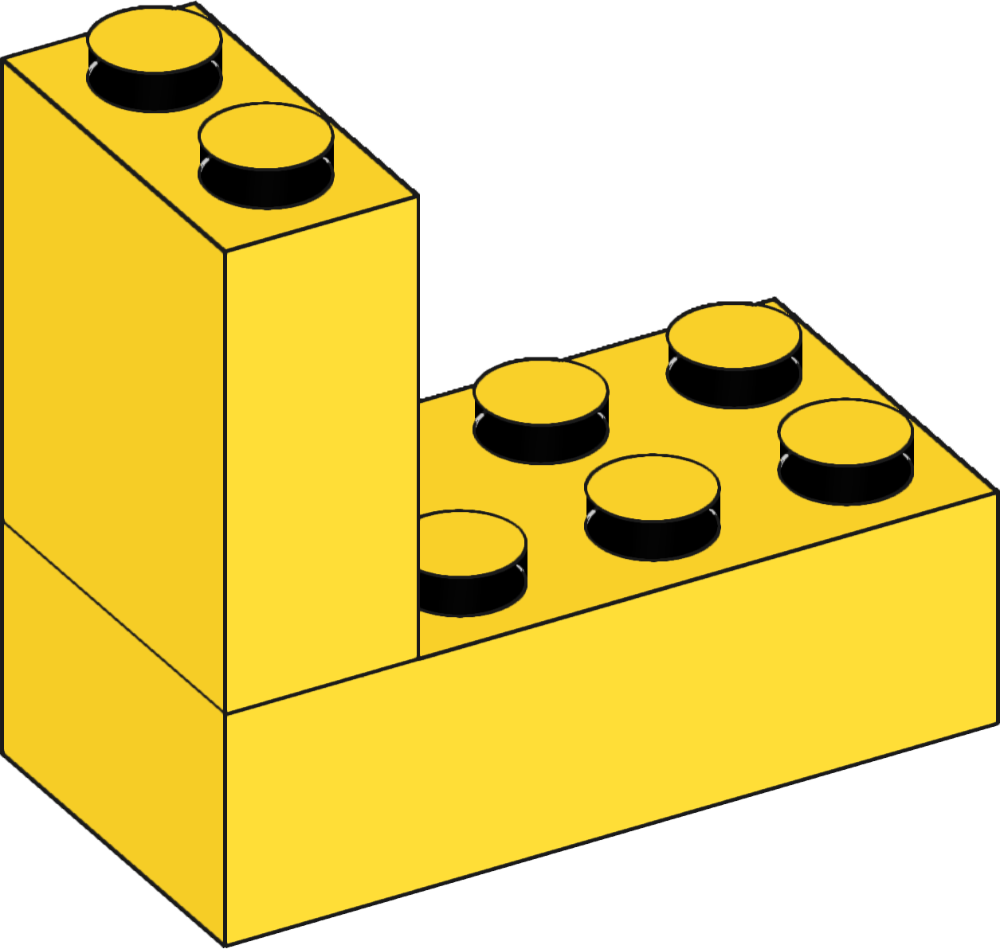
  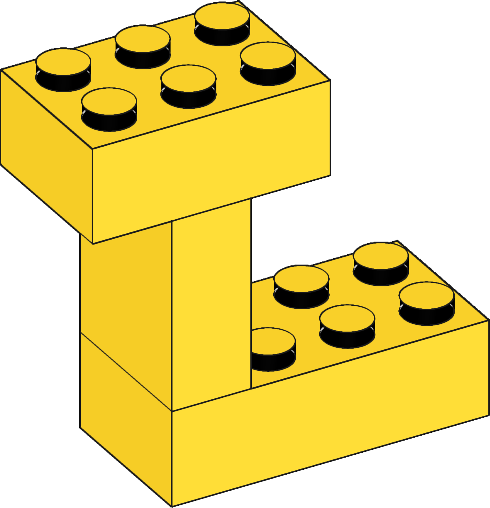
  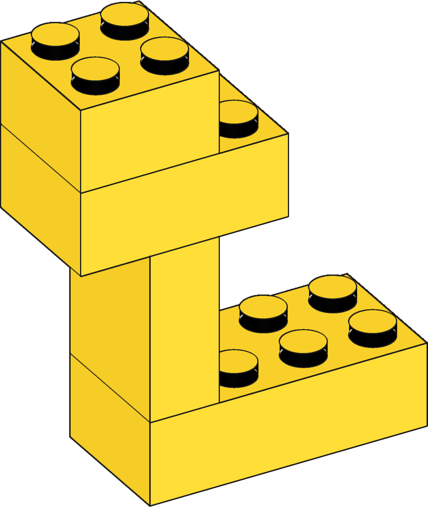
  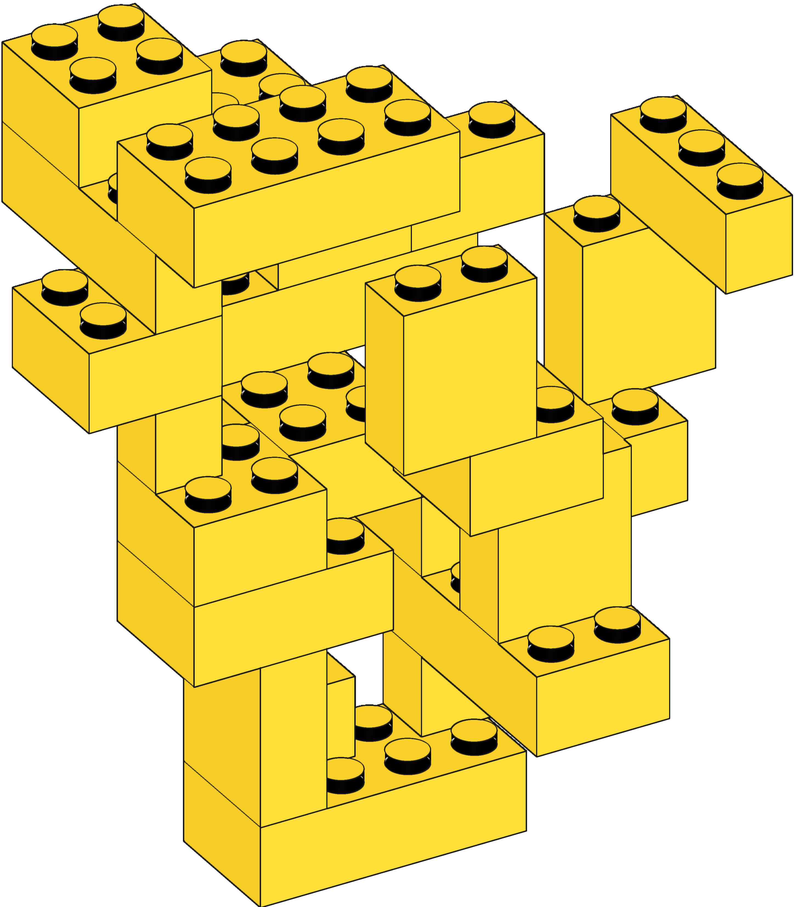
</div>

::right::

<div class="h-full relative">
<div v-click.hide="1" class="absolute inset-0 m-auto size-fit">
```html
<script src="myScript.js"></script>
```

</div>
<div v-click="[1, 2]" class="absolute inset-0 m-auto size-fit">
```html
<script src="myHugeScript.js"></script>
```

</div>
<div v-click="[2, 3]" class="absolute inset-0 m-auto size-fit">
```html
<script src="utils.js"></script>
```

</div>
<div v-click="[3, 4]" class="absolute inset-0 m-auto size-fit">
```html
<script src="utils.js"></script>
<script src="validation.js"></script>
```

</div>
<div v-click="[4, 5]" class="absolute inset-0 m-auto size-fit">
```html
<script src="utils.js"></script>
<script src="validation.js"></script>
<script src="ajax.js"></script>
```

</div>
<div v-click="[5, 6]" class="absolute inset-0 m-auto size-fit">
```html
<script src="utils.js"></script>
<script src="validation.js"></script>
<script src="ajax.js"></script>
<script src="main.js"></script>
```

</div>
<div v-click="6" class="absolute inset-0 m-auto size-fit">
```html
<script src="utils.js"></script>
<script src="validation.js"></script>
<script src="ajax.js"></script>
<script src="main.js"></script>
...
```

</div>
</div>

<!-- Le code JS est intégré aux pages HTML via le tag script. Pour des petits scripts autonome ça marche bien, mais si j'ai beaucoup de code couplé à mettre ? Les développeurs ont le choix de tout mettre dans un seul script énorme ou de diviser en plusieurs scripts (donc autant de balises). (sans parler des scripts tiers qui fonctionnent exactement de la même manière). Script inline ou fichier dédié, c'est exactement la même chose. Insister sur le fait que c'est via le document HTML que le javascript est parsé et exécuté. C'est dans le contexte HTML (document, navigateur) que le javascript est exécuté et donc que les scripts peuvent interagir entre eux. A cette époque on fait peu de javascript donc c'est pas un problème -->

---
layout: two-cols-header
---

# {{ $page - 2 }} &nbsp;&nbsp;&nbsp;Scripts ≠ Modules

<!-- TODO: faire une fiche avec des étapes 1/2 pour illustrer l'ordre de chargement de main.js et utils.js -->

::left::
<div class="h-full relative">
  
  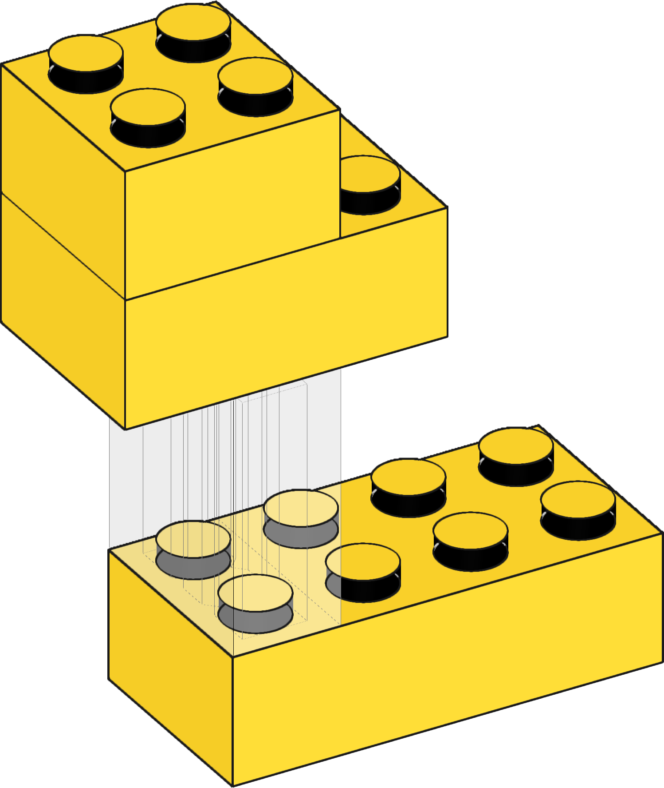
  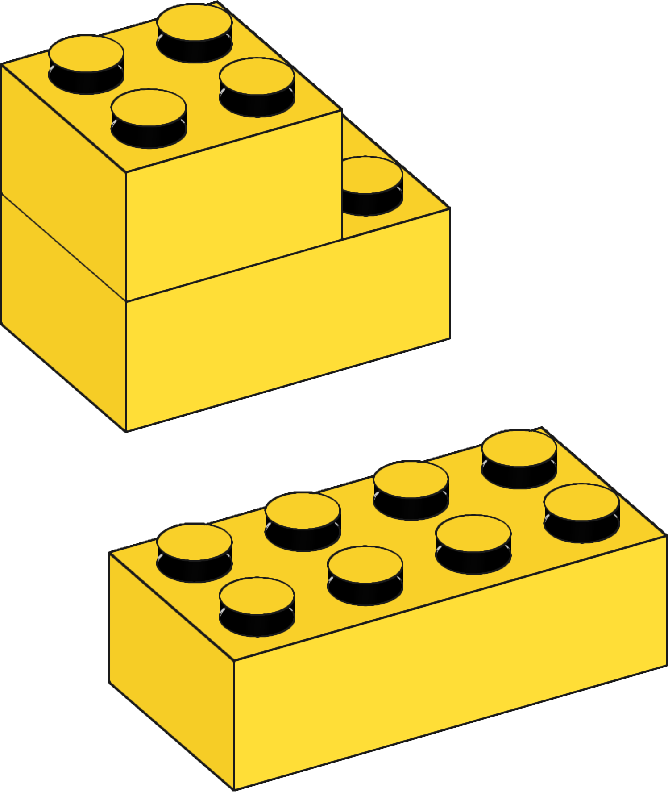
  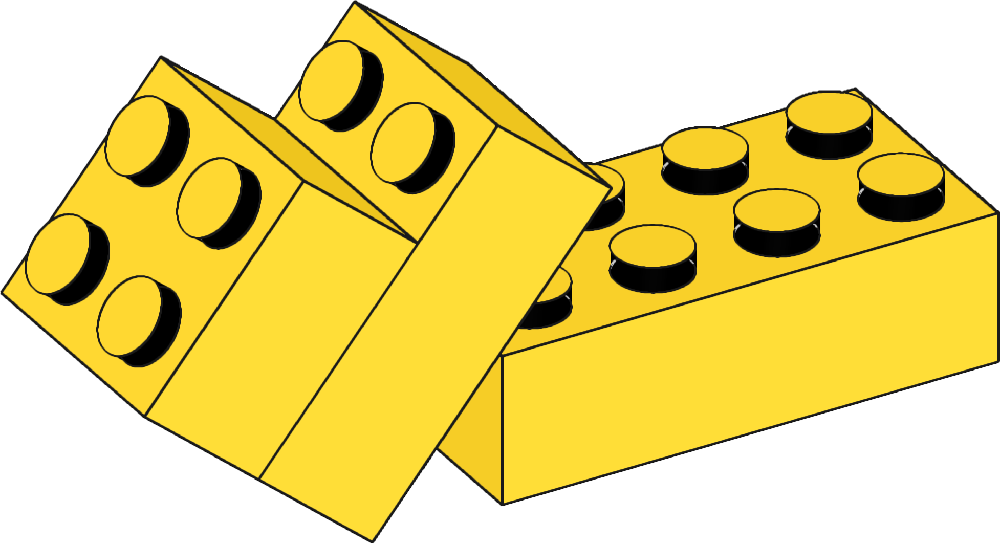


  
  <span v-click="6" class="absolute top-30 left-70 rotate-28">window</span>
  
  
</div>

::right::

<div class="h-full relative">
<div v-click="[1, 2]" class="absolute inset-0 m-auto size-fit">
```html
<script src="utils.js"></script>
<script src="main.js"></script>
...
```

```js
// utils.js
function formatDate(date) {
  return date.toISOString().split('T')[0];
}

// main.js
console.log(formatDate(new Date()));
```

</div>
<div v-click="[2, 4]" class="absolute inset-0 m-auto size-fit">
```html
<script src="main.js"></script>
<script src="utils.js"></script>
...
```

```js
// main.js
console.log(formatDate(new Date()));

// utils.js
function formatDate(date) {
  return date.toISOString().split('T')[0];
}
```

</div>
<div v-click="[4, 5]" class="absolute inset-0 m-auto size-fit">
```html
<script src="main.js"></script>
<script src="utils.js"></script>
...
```

```js
// main.js
console.log(formatDate(new Date()));
// Uncaught ReferenceError: 
// formatDate is not defined

// utils.js
function formatDate(date) {
  return date.toISOString().split('T')[0];
}
```

</div>
<div v-click="[7, 8]" class="absolute inset-0 m-auto size-fit">
```html
<script src="utils.js"></script>
<script src="main.js"></script>
...
```

```js
// utils.js
function formatPrice(price) {
  return '$' + price.toFixed(2);
}

// Your code
var displayPrice = formatPrice(19.99);
console.log(displayPrice);
// $19.99 👌
```

</div>
<div v-click="8" class="absolute inset-0 m-auto size-fit">
```html
<script src="utils.js"></script>
<script src="thirdParty.js"></script>
<script src="main.js"></script>
...
```

```js
// utils.js
function formatPrice(price) {
  return '$' + price.toFixed(2);
}

// thirdParty.js 
function formatPrice(price, currency) {
  return price.toFixed(2) + currency;
}

// Your code
var displayPrice = formatPrice(19.99);
console.log(displayPrice);
// 19.99undefined 🤯
```

</div>
</div>

<!-- Quand on combine des scripts: objet window global (dépendances implicites) et ordre de chargement qui compte, side effects et surtout collision car pas de namespace (t'es jamais sûr de pas écraser une variable définie ailleurs). En fait c'est comme tout concaténer dans un seul script. -->

---
layout: two-cols-header
---

# {{ $page - 2 }} &nbsp;&nbsp;&nbsp; Namespacing et IIFEs

::left::
<div v-click="1" class="flex flex-col bg-[#ffffde] border border-black rounded-lg h-fit w-fit overflow-clip m-auto mt-10">
 
 
</div>

::right::

<div class="h-full relative">
<div v-click="1" class="absolute inset-0 m-auto mt-10 w-17/20">

```js
// utils.js
var MyApp = MyApp || {};

MyApp.utils = (function() {
  var myPrivateVar = {};

  return {
    formatDate: function(date) {
      return date.toISOString();
    }
  };
})();
```

</div>
<div v-click="2" class="absolute inset-0 m-auto mt-10 w-17/20">

```js
// utils.js
var MyApp = MyApp || {};

MyApp.utils = (function() {
  var myPrivateVar = {};

  return {
    formatDate: function(date) {
      return date.toISOString();
    }
  };
})();

// main.js
console.log(MyApp.utils.formatDate(new Date()));
```

</div>
</div>


<!-- Solution: des patterns émergent pour créer de la modularité en pratique: n'exposer que les parties dont on a besoin publiquement et garder les détails d'implémentation -->

---
layout: two-cols-header
---

# {{ $page - 2 }} &nbsp;&nbsp;&nbsp; JavaScript sort des navigateurs

::left::
<div class="h-full relative">
  
  
</div>

::right::

<div class="h-full relative">
  
  
</div>

<!-- Bilan: Tout ce qu'on a vu, c'est le standard de fonctionnement de JS dans un navigateur, et ça fonctionnait. Mais à la fin des années 2000, Javascript va profondément se transformer en devenant un langage utilisable côté serveur (attention, il y a eu des runtimes serveurs depuis le milieu des années 90 (netscape) mais jamais vraiment d'essor.). Ce qui se passe à la fin des années 2000 de décisif: sortie de V8 en septembre 2008, un moteur JavaScript très performant, conçu pour être embeddable (pas lié à un navigateur) et open-source. Node sort en mai 2009, basé sur V8, wrapper autour de V8 avec de l'I/O asynchrone et une event loop. Donc fin des années 2000 - début des années 2010, on a une stack technique qui se met en place pour faire du JS côté serveur. -->

---
transition: fade
---

# {{ $page - 2 }} &nbsp;&nbsp;&nbsp;Un écosystème JavaScript côté-serveur ?

<div class="h-full grid place-items-center">
  
</div>

<!-- Fin des années 2000: moment d'effervescence autour de JavaScript. On a parlé des aspects techniques, mais ce n'est pas tout. Au même moment, va se mettre en place un vrai écosystème JavaScript serveur. Kevin Dangoor un développeur de Mozilla publie un post sur son blog qui va avoir un grand retentissement: il dit dedans que le JS côté serveur n'a pas tant besoin de solutions techniques (il y a en a plein qui existent déjà), mais d'un écosystème: une lib standard, des interfaces standard,  un certain nombre de conventions, un moyen unique et simple de publier et d'installer des dépendances en cross-platform, et... une méthode standard pour inclure des modules et les scoper proprement.-->

---
layout: quote
---

<div class="text-4xl/10">JavaScript needs a <span class="font-bold">standard way to include other modules</span> and for those modules to live in discreet namespaces. There are easy ways to do namespaces, but there’s no standard programmatic way to load a module (once!). This is really important, because server side apps can include a lot of code (...).</div>

<!-- Le JS côté serveur a vraiment besoin d'un système de modules car il y aura beaucoup plus de code avec un usage plus général. K Dangoor crée un groupe de discussion nommé ServerJS, qui sera renommé rapidement CommonJS. Attention CommonJS ne fait partie du TC39, elle ne définit pas une spécification officielle de JavaScript. Une spécification pour un système de module est rapidement établie et adoptée par NodeJS.-->

---
layout: section
---

<span class="text-5xl font-bold">Les modules CommonJS</span>

---
layout: two-cols-header
---

# {{ $page - 4 }} &nbsp;&nbsp;&nbsp; Une spécification simple

::left::

<div class="h-full relative">
  
  
  
  
  
  
  
</div>

::right::

<div class="h-full relative">
<div v-click="[1, 2]" class="absolute top-0 left-1/2 -translate-x-1/2 w-17/20">

```js
// main.js
(...)
```

</div>
<div v-click="[2, 3]" class="absolute top-0 left-1/2 -translate-x-1/2 w-17/20">

```js
// main.js
(...)

var module = require('./module');
```

</div>
<div v-click="[3, 4]" class="absolute top-0 left-1/2 -translate-x-1/2 w-17/20">

```js
// module.js 
var private = "not exported";
console.log(private);
```

</div>
<div v-click="[4, 5]" class="absolute top-0 left-1/2 -translate-x-1/2 w-17/20">

```js
// module.js 
var private = "not exported";
console.log(private);
```

```
"not exported"
```

</div>
<div v-click="[5, 6]" class="absolute top-0 left-1/2 -translate-x-1/2 w-17/20">

```js
// module.js
var private = "not exported";
console.log(private);

exports.foo = "foo";
```

</div>
<div v-click="[6, 7]" class="absolute top-0 left-1/2 -translate-x-1/2 w-17/20">

```js
// module.js
var private = "not exported";
console.log(private);

exports.foo = "foo";
exports.bar = "bar";
```

</div>
<div v-click="[7, 8]" class="absolute top-0 left-1/2 -translate-x-1/2 w-17/20">

```js
// module.js
var private = "not exported";
console.log(private);

exports.foo = "foo";
exports.bar = "bar";
exports.baz = "baz";
```

</div>
<div v-click="[8, 9]" class="absolute top-0 left-1/2 -translate-x-1/2 w-17/20">

```js
// main.js
(...)

var module = require('./module');
```

</div>
<div v-click="9" class="absolute top-0 left-1/2 -translate-x-1/2 w-17/20">

```js
// main.js
(...)

var module = require('./module');

var foo = module.foo; // 'foo'
var bar = module.bar; // 'bar'
var baz = module.baz; // 'baz'
```

</div>
<ul class="absolute h-30 bottom-0 right-0">
  <li v-click="2">Fonction synchrone require()</li>
  <li v-click="3">Exécution récursive des modules importés</li>
  <li v-click="9">Import/export via les propriétés de l'objet exports</li>
</ul>
</div>


<!-- La spec définit de manière simple comment on exporte et importe des modules. Chaque module a accès à une fonction globale, require, qui prend en argument un identifiant de module et exécute le code du module pour obtenir son API exportée. Au moment où on exécute le require, les exports du module sont inconnus, il faut résoudre. Pour cela chaque module a un objet exports auquel on peut donner des propriétés (on ne peut pas le réassigner).

La spec est pensée pour le serveur: tous les fichiers sont sur le même filesystem donc le coût de chargement d'un module est négligeable. Modèle mental assez simple. On require, on exécute et on retourne les exports. Tout se fait au runtime, les imports et exports sont des instructions (appel de fonction et assignation à un objet). Architecture require-first.

Comme on exécute les modules pour définir leur imports, attention aux side-effects (mais ça peut être utile).
 -->

---
layout: two-cols-header
disabled: true
---

# {{ $page - 4 }} &nbsp;&nbsp;&nbsp;Dépendances circulaires

<div class="absolute inset-0 m-auto size-full">
  
  <Arrow v-click="[2, 6]" x1="530" y1="200" x2="620" y2="250" />
  
  <Arrow v-click="[3, 6]" x1="650" y1="300" x2="545" y2="375" />
  
  <Arrow v-click="[4, 6]" x1="430" y1="365" x2="340" y2="310" />
  
  <Arrow v-click="[5, 6]" x1="340" y1="250" x2="450" y2="180" />
  
</div>

::left::

<div class="h-full relative mt-10">
<div v-click="[7, 12]" class="absolute inset-0 size-fit w-17/20">

```js
//a.js
var b = require('b.js');
```

</div>
<div v-click="[12, 13]" class="absolute inset-0 size-fit w-17/20">

```js
//a.js
exports.foo = "foo";

var b = require('b.js');
```

</div>
<div v-click="[13, 16]" class="absolute inset-0 size-fit w-17/20">

```js
//a.js
exports.foo = "foo";

var b = require('b.js');

exports.bar = "bar";
```
</div>
<div v-click="16" class="absolute inset-0 size-fit w-17/20">

```js
//a.js
exports.foo = "foo";

var b = require('b.js');

exports.bar = "bar";

console.log(b.baz); // "baz"
```
</div>

  <div v-click="[8, 12]" class="absolute bottom-40 left-8 border border-black w-fit">
      <span class="border-black border-r px-5">a.js</span>
      <span class="px-5 inline-block w-60">{}</span>
  </div>
  <div v-click="[12, 15]" class="absolute bottom-40 left-8 border border-black w-fit">
      <span class="border-black border-r px-5">a.js</span>
      <span class="px-5 inline-block w-60">{ foo: "foo" }</span>
  </div>
  <div v-click="[15, 16]" class="absolute bottom-33 left-8 border border-black w-fit">
    <div class="border-b border-black">
      <span class="border-black border-r px-5">a.js</span>
      <span class="px-5 inline-block w-60">{ foo: "foo" }</span>
    </div>
    <div>
      <span class="border-black border-r px-5">b.js</span>
      <span class="px-5 inline-block w-60">{ baz: "baz" }</span>
    </div>
  </div>
  <div v-click="16" class="absolute bottom-33 left-8 border border-black w-fit">
    <div class="border-b border-black">
      <span class="border-black border-r px-5">a.js</span>
      <span class="px-5 inline-block w-60">{ foo: "foo", bar: "bar" }</span>
    </div>
    <div>
      <span class="border-black border-r px-5">b.js</span>
      <span class="px-5 inline-block w-60">{ baz: "baz" }</span>
    </div>
  </div>
</div>

::right::

<div class="h-full relative mt-10">
<div v-click="[7, 10]" class="absolute inset-0 size-fit w-17/20">

```js
//b.js
var a = require('a.js');
```

</div>
<div v-click="[10, 11]" class="absolute inset-0 size-fit w-17/20">

```js
//b.js
var a = require('a.js');

console.log(a.foo)
```

</div>
<div v-click="[11, 12]" class="absolute inset-0 size-fit w-17/20">

```js
//b.js
var a = require('a.js');

console.log(a.foo) // undefined
```

</div>
<div v-click="[12, 14]" class="absolute inset-0 size-fit w-17/20">

```js
//b.js
var a = require('a.js');

console.log(a.foo) // 'foo'
```

</div>
<div v-click="[14, 15]" class="absolute inset-0 size-fit w-17/20">

```js
//b.js
var a = require('a.js');

console.log(a.foo) // 'foo'
console.log(a.bar) // undefined
```

</div>
<div v-click="15" class="absolute inset-0 size-fit w-17/20">

```js
//b.js
var a = require('a.js');

console.log(a.foo) // 'foo'
console.log(a.bar) // undefined

exports.baz = "baz";
```

</div>
<ul class="absolute h-30 bottom-20 -right-5">
  <li v-click="8">Les exports du module parent au moment de l'import sont exposés à l'enfant</li>
  <li v-click="9">Les module sont cachés (une seule exécution)</li>
  <li v-click="17">Exécution unique mais possiblement en plusieurs fois</li>
</ul>
</div>

<!-- Les dépendances circulaires sont gérées en utilisant la valeur d'exports au moment où la dépendance circulaire commence. C'est-à-dire que quand on require un module, s'il a déjà été (même partiellement !) exécuté, il n'est pas exécuté à nouveau mais on utilise la valeur de son objet exports (qui pourra changer si l'exécution reprend après la résolution des dépendances). 

Plusieurs conséquences: 
* Les dépendances circulaires fonctionnent
* Attention à l'ordre de chargement des modules qui change le résultat à l'exécution
* Il y a donc un cache de modules: c'est là qu'on stocke les exports du module qui importe. Chaque module est chargé une seule fois (au total, ça peut se faire en plusieurs fois si on est interrompu par un require). -->


---

# {{ $page - 4 }} &nbsp;&nbsp;&nbsp; De CommonJS à Node.js

<div class="h-full relative">
  
  
  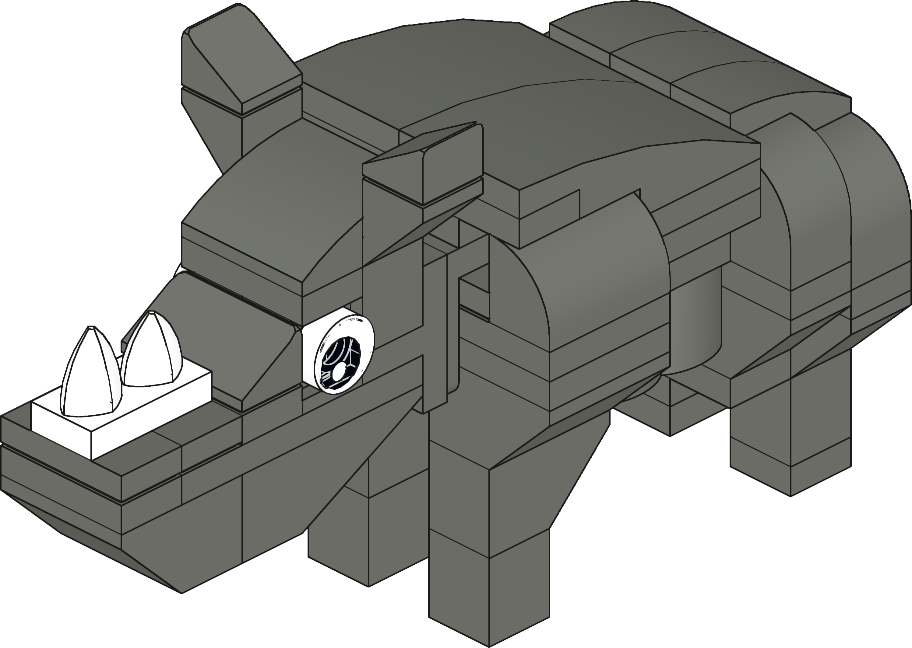
  
  
  
  
</div>

<!-- A cette période, Node.js n'est qu'un runtime JS serveur parmi d'autres (on a des outils il manquait un écosystème). Tous sont liés de près où de loin à CommonJS. Au début des années 2010, node devient le standard de facto du JS côté serveur et les alternatives ne décollent jamais (narwhal, ringoJS, v8cgi (teaJS), GPSEE). 

Ca créé des tensions dans la communauté (entre les contributeurs commonJS qui essayent d'élaborer une spec et n'implémentent rien et nodeJS). Le truc intéressant: node a implémenté les modules de commonJS, juste pas les autres trucs, mais Node est devenu le standard donc ça fait survivre les modules et on a oublié tout le reste de ce qui a été proposé par commonJS. Consensus: CommonJS était un projet trop ambitieux, mais ça a permis de faire node qui est devenu le standard côté serveur, donc un standard a bien émergé et tout le monde est content.  -->

---
layout: two-cols-header
---

# {{ $page - 4 }} &nbsp;&nbsp;&nbsp; Le module wrapper de Node.js

::left::

<div class="h-full relative">
  
  <span v-click="[2, 3]" class="absolute top-25 left-50 text-5xl font-bold">?</span>
  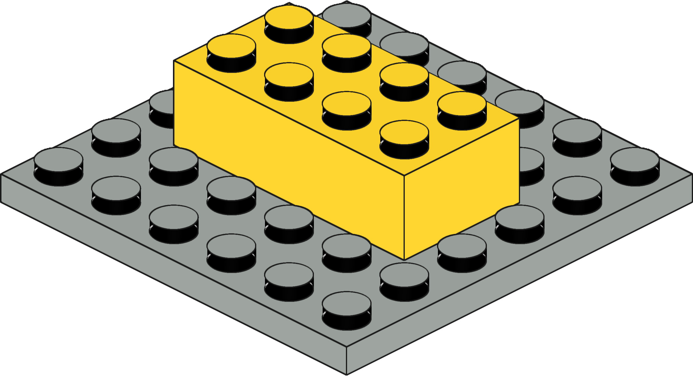
</div>

::right::

<div class="h-full relative mt-10">
<div v-click="[1, 3]" class="absolute size-fit">

```js
var count = require("./count.js");

exports.foo = "foo"
```

</div>
<div v-click="3" class="absolute size-fit">

```js
(function(exports, require, module, __filename, __dirname) {
  var count = require("./count.js");

  exports.foo = "foo"
}); 
```

</div>
<ul class="absolute bottom-30 right-0">
  <li v-click="4">Les fonctions et objets relatifs aux modules sont injectés comme arguments d'une fonction</li>
  <li v-click="5">Apparence de variables globales, mais uniques à chaque module</li>
</ul>
</div>

 <!-- Spécificités de l'implémentation de node. 
Module wrapper: à l'exécution, Node wrappe le module dans une fonction dans laquelle il injecte 5 paramètres, exports, require, module, __filename et __dirname. Ca permet d'avoir des variables "globales" (on ne les importe jamais manuellement) mais en fait propres à chaque module. Notamment la fonction require est unique pour chaque fonction
Objet module. -->

---
layout: two-cols-header
disabled: true
---

# {{ $page - 4 }} &nbsp;&nbsp;&nbsp; L'objet module

::left::

<div class="h-full relative">
  
  
  
  
</div>

::right::

<div class="h-full relative ps-10 pt-10">
<div v-click="[1, 2]" class="absolute w-17/20">

```js
// module.js
exports.foo = "foo";
exports.bar = "bar";
exports.baz = "baz";
```

</div>
<div v-click="[2, 3]" class="absolute w-17/20">

```js
// module.js
class MyClass {
  ...
}

exports.instance = new MyClass();
```

</div>
<div v-click="[3, 4]" class="absolute w-17/20">

```js
// module.js
class MyClass {
  ...
}

exports = new MyClass();
```

</div>
<div v-click="[4, 5]" class="absolute w-17/20">

```js
// main.js
var MyClass = require('./module.js'); // {}
```

</div>
<div v-click="[5, 6]" class="absolute w-17/20">

```js
// module.js
(...)

module.exports = new MyClass();
```

</div>
<div v-click="6" class="absolute w-17/20">

```js
// module.js
(...)

module.exports = new MyClass();
console.log(module.exports === exports); // true
```

</div>
<ul class="absolute bottom-0">
  <li v-click="1">Les exports fonctionnent par création de propriétés sur l'objet exports</li>
  <li v-click="3">Impossible de réassigner un argument de fonction</li>
  <li v-click="6">exports est un raccourci pour module.exports</li>
</ul>
</div>

<!-- Jusqu'ici on a uniquement exporté via exports, comme d'après la spec CommonJS. Mais c'est pas la façon habituelle de faire, on utilise module.exports. Simple question d'assignation, si on veut retourner une seule valeur (genre une instance de classe), on ne peut pas réassigner l'objet exports (on change la référence, ça devient un objet local au module) -->

---
layout: two-cols-header
disabled: true
---

# {{ $page - 4 }} &nbsp;&nbsp;&nbsp; Manipulation de modules

::left::

<div class="h-full relative">
  
  
  

  <div v-click="[1, 4]" class="absolute bottom-20 -left-5 border border-black w-fit">
    <span class="border-black border-r px-1">module.js</span>
    <span class="px-1 inline-block">{ foo: function() { console.log('foo'); } }</span>
  </div>
  <div v-click="4" class="absolute bottom-20 -left-5 border border-black w-fit">
    <span class="border-black border-r px-1">module.js</span>
    <span class="px-1 inline-block">{ foo: function() { console.log('bar'); } }</span>
  </div>
</div>

::right::

<div class="h-full relative">
<div v-click.hide="2" class="absolute top-0 left-1/2 -translate-x-1/2 w-17/20">

```js
// module.js
var foo = function () {
  console.log('foo');
}

exports.foo = foo;
```

</div>
<div v-click="[2, 3]" class="absolute top-0 left-1/2 -translate-x-1/2 w-17/20">

```js
// main.js
var module = require('./module.js');
var module2 = require('./module.js');
```

</div>
<div v-click="[3, 4]" class="absolute top-0 left-1/2 -translate-x-1/2 w-17/20">

```js
// main.js
var module = require('./module.js');
var module2 = require('./module.js');

console.log(module === module2); // true
```

</div>
<div v-click="[4, 5]" class="absolute top-0 left-1/2 -translate-x-1/2 w-17/20">

```js
// main.js
var module = require('./module.js');
module.foo(); // 'foo'

module.foo = function() {
  console.log('bar');
}
module.foo(); // 'bar'
```

</div>
<div v-click="5" class="absolute top-0 left-1/2 -translate-x-1/2 w-17/20">

```js
// main.js
var module = require('./module.js');
module.foo(); // 'foo'

module.foo = function() {
  console.log('bar');
}
module.foo(); // 'bar'

var module2 = require('./module.js');
module2.foo(); // 'bar'
```

</div>
<ul class="absolute bottom-10">
  <li v-click="3">Chaque module n'est exécuté qu'une fois</li>
  <li v-click="4">Les propriétés des modules sont mutables 🤯</li>
  <li v-click="6">Les modifications sont visibles globalement</li>
</ul>
</div>

<!-- Comme chaque module est instancié une seule fois, du coup un module peut en modifier un autre et la modification est active pour tous les autres consommateurs. -->

---

# {{ $page - 4 }} &nbsp;&nbsp;&nbsp; Un système de modules synchrone

<div class="absolute inset-0 m-auto w-3/4 h-fit pb-5 pt-12 border border-black rounded-md flex items-center justify-evenly z-1">
  <div class="absolute m-auto top-2">require()</div>
  <div class="absolute -z-1 flex items-center">
    <div class="w-200 h-10 bg-gray-500"></div>
    <div class="w-0 h-0 border-t-30 border-t-transparent border-l-30 border-l-gray-500 border-b-30 border-b-transparent"></div>
  </div>
  <div class="size-30 border border-black rounded-md p-3 grid place-items-center bg-#d3ecfd">Resolution</div>
  <div class="size-30 border border-black rounded-md p-3 grid place-items-center bg-#d3ecfd">Loading</div>
  <div class="size-30 border border-black rounded-md p-3 grid place-items-center bg-#d3ecfd">Wrapping</div>
  <div class="size-30 border border-black rounded-md p-3 grid place-items-center bg-#d3ecfd">Evaluation</div>
  <div class="size-30 border border-black rounded-md p-3 grid place-items-center bg-#d3ecfd">Caching</div>
  <div class="absolute -bottom-8 right-0 text-sm">credit: James M Snell</div>
</div>

<!-- TODO SLIDE Est-ce que ça a des influences côté-client ? AMD/require.js: modules asynchrones pour le navigateur. Browserify into Webpack. Naissance du bundling avec phases de build. -->

<!-- Résumé de ce qui se passe quand on importe un module en cjs dans node.-->

---

# {{ $page - 4 }} &nbsp;&nbsp;&nbsp; En résumé

<div class="h-full relative">
  
  
  
</div>

<!-- TODO: Imports dynamiques en CJS à partir de variables (en parler pour dire que c'est plus possible en ESM ?) -->

<!-- Recap CJS:
* Un système synchrone (chaque module est chargé quand il est requis) ou tout se fait au runtime (require est une fonction JS qu'on appelle, on ne connaît pas les exports à l'avance) 
* Un système pensé pour le serveur
* Implémentation par des runtimes, pas une feature de JS (wrapper les modules)
-->

---

# {{ $page - 4 }} &nbsp;&nbsp;&nbsp; Pendant ce temps au TC39...

<div class="h-full">
  
  <span v-click="[2, 6]" class="absolute top-90 right-65 m-auto">Classes</span>
  
  <span v-click="[3, 6]" class="absolute top-85 left-65 m-auto">Interfaces</span>
  
  <span v-click="[4, 6]" class="absolute top-60 left-50 m-auto">Typage strict</span>
  
  <span v-click="[5, 6]" class="absolute top-40 right-30 m-auto">Modules<br> et namespaces</span>
  
  
</div>

<!-- Pourquoi les modules sont pas dans la spec ? A la base JS est un petit langage de script, standarisé en ECMAScript. PB: dans les années 2000, aucune évolution du langage ou presque (projet de ES4 avec des packages (modules) beaucoup trop ambitieux bloqué par Microsoft). Aucune sortie majeure avant ES6 en 2015. Les modules sont dans ES6, moins ambitieux que les packages. -->

---
layout: section
---

<span class="text-5xl font-bold">Les modules ECMAScript</span>


---

# {{ $page - 5 }} &nbsp;&nbsp;&nbsp; Le standard ESM

<div v-click="[1, 2]" class="absolute inset-0 w-full flex justify-evenly items-center">
  
  
</div>


<div v-click="[3, 5]" class="absolute inset-0 w-full flex justify-evenly items-center">
  <div class="p-10">
    
  </div>
  <div class="p-10">
    
  </div>
</div>

<div v-click="[5, 6]" class="absolute inset-0 w-full flex justify-evenly items-center">
  <div class="p-10 bg-green-100 outline outline-1 outline-black rounded-lg">
    
  </div>
  <div class="p-10">
    
  </div>
</div>

<div v-click="6" class="absolute inset-0 w-full flex justify-evenly items-center">
  <div class="p-10 bg-green-100 outline outline-1 outline-black rounded-lg relative">
    
    
  </div>
  <Arrow v-click="10" x1="380" y1="250" x2="505" y2="250" />
  <Arrow v-click="10" x1="505" y1="300" x2="380" y2="300" />
  <div class="p-10 bg-red-100 outline outline-1 outline-black rounded-lg relative">
    
    
    
  </div>
</div>

<!-- Histoire de la conception de ES6 -> des gens qui ont participé à CJS proposent des modules au TC39, ils collaborent. Problème: il faut faire une spec de modules universelle, et maintenant le server-side existe, ça ne peut pas être que une spec pour le navigateur, il faut accomoder les différents environnements d'exécution. Donc la spec se sépare en 2, une spec des ES modules pour JS (sémantique, construction des modules, lien, exécution: comment les modules fonctionnent) et le loader (résolution de module, fetching: d'où viennent les modules et comment les récupérer). Problème: la spec du loader est très difficile à écrire et devient le bottleneck pour la spec de modules qui existe -> Décision prise en 2014 de déléguer l'implémentation des modules à l'environnement, la spec ESM définit des opérations qui doivent être implémentées par l'environnement (résolution, loading). -->

---
layout: two-cols-header
disabled: true
---

# {{ $page - 5 }} &nbsp;&nbsp;&nbsp; Une nouvelle interface

::left::

<div class="h-full relative">
<div v-click="1" class="absolute top-0 left-1/2 -translate-x-1/2 w-18/20">

```js
import defaultExport from "module-name";

import * as name from "module-name";

import { export1 } from "module-name";

import { export1 as alias1 } from "module-name";

import { export1, export2 } from "module-name";

import defaultExport, { export1 } from "module-name";

import defaultExport, * as name from "module-name";

import "module-name";
```
    
</div>
</div>

::right::

<div class="h-full relative">
<div v-click="2" class="absolute top-0 left-1/2 -translate-x-1/2 w-18/20">

```js
export const name1 = 1, name2 = 2/*, … */;

export { name1, /* …, */ nameN };

export { variable1 as name1, variable2 as name2 };

export { name1 as default /*, … */ };

export default function functionName() { /* … */ }

export * from "module-name";
```
    
</div>
</div>

<!-- Présentation de l'interface, statement et fonction import. Insister sur le statement, toujours top level, analysable de manière statique. Pas du tout utilisé lors de l'exécution d'un fichier mais uniquement lors d'une phase de construction des modules.
 -->

---

# {{ $page - 5 }} &nbsp;&nbsp;&nbsp; Comment charger des modules ?

<div v-click="2" class="flex bg-[#ffffde] border border-black rounded-lg w-fit h-sm overflow-clip m-auto mt-10 items-center p-5">
  <div v-click="2" class="max-h-80 p-8 py-10 pt-12 relative">
    <span class="absolute top-0 left-8 text-3xl">1</span>
    
  </div>
  <div v-click="3" class="max-h-80 p-10 px-15 border-l border-black relative">
    <span class="absolute top-0 left-8 text-3xl">2</span>
    
  </div>
  <div v-click="4" class="max-h-80 px-10 border-l border-black relative">
    <span class="absolute top-0 left-8 text-3xl">3</span>
    
  </div>
</div>

<!-- Présentation des 3 phases asynchrones: construction: trouver les modules, les télécharger et les parser en module records, équivalent de récupérer toutes les pièces nécessaires pour un lego, instantiation: réserver de l'espace mémoire pour les imports/exports (linking) équivalent d'assembler les pièces mais on ne les fait pas encore fonctionner, evaluation: exécution du code pour remplir l'espace mémoire avec des valeurs, fonctionnement de l'objet. Asynchrone pour le navigateur -->

---
layout: two-cols-header
---

# {{ $page - 5 }} &nbsp;&nbsp;&nbsp; Construction

::left::

<div class="h-full relative">
  
  
  
  
  
</div>

::right::

<div class="h-full relative">
<div v-click="[3, 4]" class="absolute top-0 left-1/2 -translate-x-1/2 w-17/20">

```html
<script src="main.js" type="module">
```

</div>
<div v-click="[4, 5]" class="absolute top-0 left-1/2 -translate-x-1/2 w-17/20">

```js
// main.js
import { something } from "module.js"

...
```

</div>
<div v-click="[5, 6]" class="absolute top-0 left-1/2 -translate-x-1/2 w-17/20">

```js
// module.js
import { somethingElse } from "anotherModule.js"

...
```

</div>
<div v-click="6" class="absolute top-0 left-1/2 -translate-x-1/2 w-17/20">

```js
// anotherModule.js
import { anotherThing } from "otherModule.js"

...
```

</div>
<ul class="absolute left-10 bottom-10">
  <li v-click="2">Tous les modules sont chargés avant l'exécution du code</li>
  <li v-click="3">L'arbre de modules est construit à partir du point d'entrée</li>
  <li v-click="4">Chaque import est résolu et récupéré par le loader</li>
  <li v-click="7">L'interpréteur transforme le code source en module record et met en cache</li>
</ul>
</div>


<!-- TODO Rajouter une partie sur la résolution -->

<!-- Construction de l'arbre des modules. Comment on passe d'un point d'entrée à un arbre de module records. Parler des différences avec CJS, asynchrone parce que on fait toute la construction d'un coup, on évalue pas chaque module puis on fait l'import à la volée, on va d'abord résoudre tous les imports: avant l'exécution du moindre module, le moteur connaît tout l'arbre de dépendances. C'est asynchrone donc le main thread n'est pas bloqué: on peut fetch les modules découverts en parallèle et la page répond toujours. Première phase: résolution, le moteur trouve une déclaration d'import, il délègue la résolution au loader qui va fetcher dans la foulée (en http ou dans le filesystem) le moteur reçoit le code source (non évalué) et va le parser (pas l'exécuter) pour créer un module record. C'est une représentation du module qui contient le code mais aussi les imports/exports. Les modules sont placés dans une import map (un cache) -->

---
layout: two-cols-header
---

# {{ $page - 5 }} &nbsp;&nbsp;&nbsp; Instanciation

::left::

<div class="h-full relative">
  
  
  
  
  
</div>

::right::

<div class="h-full relative">
<div v-click="[1, 2]" class="absolute top-0 left-1/2 -translate-x-1/2 w-17/20">

```js
// module.js

// no imports !

... // no code is evaluated yet

export const foo = "foo";
```

</div>
<div v-click="[2, 3]" class="absolute top-0 left-1/2 -translate-x-1/2 w-17/20">

```js
// parent.js
import { foo } from "./module.js"

...

export const bar = "bar";
```

</div>
<div v-click="[3, 4]" class="absolute top-0 left-1/2 -translate-x-1/2 w-17/20">

```js
// grandParent.js
import { bar } from "./parent.js"

...

export const baz = "baz";
```

</div>
<div v-click="[4, 5]" class="absolute top-0 left-1/2 -translate-x-1/2 w-17/20">

```js
// module.js
export let count = 0;
export function increment() { count++ }
```

</div>
<div v-click="5" class="absolute top-0 left-1/2 -translate-x-1/2 w-17/20">

```js
// module.js
export let count = 0;
export function increment() { count++ }
```

```js
// main.js
import { count, increment } from './module.js';

console.log(count); // 0
increment();
console.log(count); // 1
```

</div>
<ul class="absolute left-10 bottom-0">
  <li v-click="1">L'arbre des modules est parcouru dans l'ordre inverse</li>
  <li v-click="3">Un espace mémoire est attribué à chaque export</li>
  <li v-click="5">Les imports sont liés au même espace mémoire (les valeurs ne sont pas copiées)</li>
</ul>
</div>

<!-- Phase de linking: réserver des espaces mémoire pour les objets qui sont importés/exportés, les espaces mémoires ne sont pas remplis à ce moment-là (il faudrait exécuter le code). Live bindings: l'import et l'export pointent sur le même espace mémoire, on ne peut pas réassigner un import. Ca permet de gérer les dépendances cycliques et de créer un arbre sans exécuter aucun code (en cjs puisqu'on copie les valeurs il faut bien connaître les valeurs). Les modules sont instanciés par le moteur.-->

---
layout: two-cols-header
---

# {{ $page - 5 }} &nbsp;&nbsp;&nbsp; Evaluation

::left::

<ul class="mt-30">
  <li v-click="1">L'arbre des modules est parcouru dans l'ordre inverse</li>
  <li v-click="2">Le code est exécuté (avec les effets de bord) 🎉</li>
  <li v-click="3">Chaque module n'est évalué qu'une seule fois</li>
</ul>


::right::


<!-- Phase d'évaluation, le code est évalué dans l'ordre inverse (on part des feuilles de l'arbre, les modules qui n'ont pas de dépendance) et on exécute le code de top-niveau. On remplit les espaces mémoire avec les valeurs.-->

---

# {{ $page - 5 }} &nbsp;&nbsp;&nbsp; Quels bénéfices ?

<div class="h-full relative">
  
  
  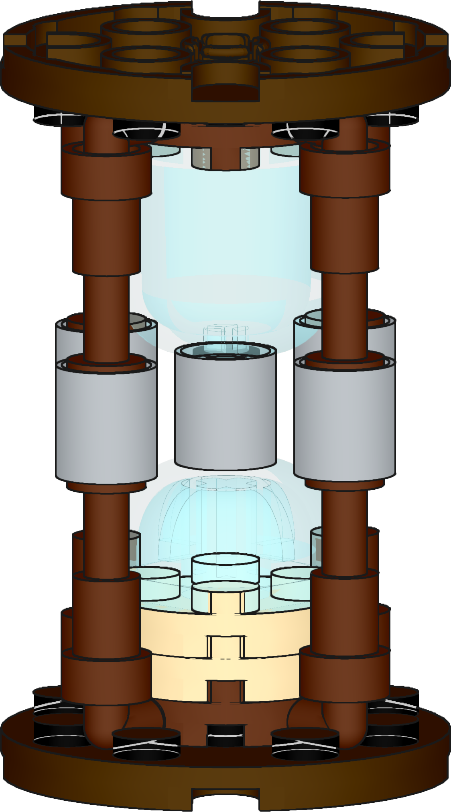
  
  
</div>

<!-- 
Dans le langage directement
Supporté par les navigateurs
Asynchrone
Meilleur support des dépendances circulaires
Static: analysable, tree-shakeable
-->

---

# {{ $page - 5 }} &nbsp;&nbsp;&nbsp; Un exemple : Vite

<div class="h-full relative">
<div class="h-full w-full grid place-items-center pb-50">
  
</div>

<div v-click class="absolute bottom-30 left-1/2 -translate-x-1/2">

```html
<!-- pas de build : ESM natif -->
<script type="module" src="/src/main.js"></script>
```

</div>
</div>

<!-- Vite est un serveur de dev très rapide construit sur le ESM. Le principe est simple, le navigateur peut importer les modules directement du coup il n'y a presque rien à faire, Vite ne fait que servir les modules (pas besoin de build l'application pour servir un seul module au serveur + se compliquer la vie pour le HMR).
Il y a aussi des vraies apps de prod qui importent directement leurs composants en ESM, pas de bundling-->

---
layout: two-cols-header
disabled: true
---

# {{ $page - 5 }} &nbsp;&nbsp;&nbsp; Modules ≠ Scripts

::left::

<div class="h-full relative">
<div v-click="[1, 3]" class="absolute top-0 left-1/2 -translate-x-1/2 w-18/20">

```html
<script>
  undefinedVariable = "foo" // no error
</script>
```

</div>
<div v-click="[3, 5]" class="absolute top-0 left-1/2 -translate-x-1/2 w-18/20">

```html
<script>
  undefinedVariable = "foo" // no error

  var global = "global"
  console.log(window.global) // "global"
</script>
```

</div>
<div v-click="[5, 7]" class="absolute top-0 left-1/2 -translate-x-1/2 w-18/20">

```html
<script>
  undefinedVariable = "foo" // no error

  var global = "global"
  console.log(window.global) // "global"

  const data = await fetch('...'); // error
</script>
```

</div>

</div>

::right::

<div class="h-full relative">
<div v-click="[2, 4]" class="absolute top-0 left-1/2 -translate-x-1/2 w-18/20">

```html
<script type="module">
  undefinedVariable = "foo" // error
</script>
```

</div>
<div v-click="[4, 6]" class="absolute top-0 left-1/2 -translate-x-1/2 w-18/20">

```html
<script type="module">
  undefinedVariable = "foo" // error

  var global = "global"
  console.log(window.global) // undefined
</script>
```

</div>
<div v-click="[6, 7]" class="absolute top-0 left-1/2 -translate-x-1/2 w-18/20">

```html
<script type="module">
  undefinedVariable = "foo" // error

  var global = "global"
  console.log(window.global) // undefined

  const data = await fetch('...'); // 👌
</script>
```

</div>
<span v-click="[7, 8]" class="text-9xl absolute inset-0 m-auto w-fit h-fit">?</span>
<div v-click="8" class="absolute top-0 left-1/2 -translate-x-1/2 w-18/20">
<div v-click="8" class="w-18/20">

```js
// module.mjs
```

</div>
<div v-click="9" class="w-18/20">

```json
// package.json
{
  type: "module"
}
```

</div>
<div v-click="10" class="w-18/20">

```js
// module.js
import something from "otherModule.js"
```

</div>

</div>
</div>

<!-- Module comme parse goal: use strict, await. Parler de type module comme quelque chose de fondamentalement différent d'un script. Ca marche pour le navigateur mais pas pour node, d'où le mjs. Parler de comment Node comprend qu'un fichier est un module.-->

---
layout: center
---

# Interopérabilité

---
layout: two-cols-header
---

# {{ $page - 5 }} &nbsp;&nbsp;&nbsp; CJS ou ESM ?

::left::

<div class="h-full flex flex-col justify-center items-center gap-5">
  
  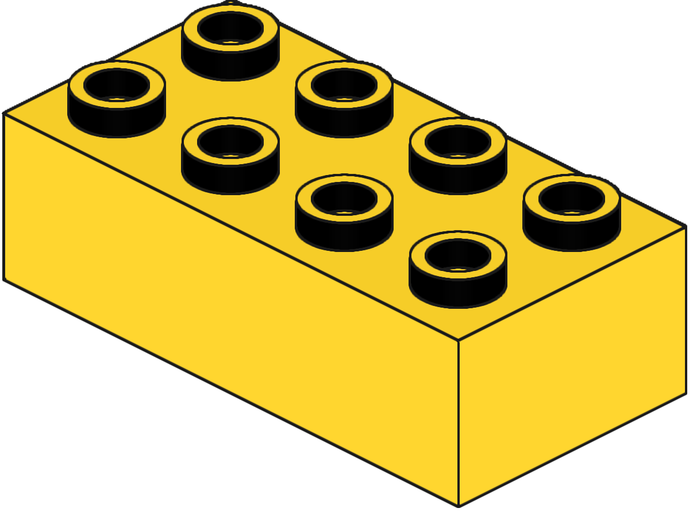
</div>

::right::

<div class="h-full flex flex-col justify-center gap-3">

<div v-click>

```js
// 1. l'extension du fichier
module.mjs   module.cjs
```

</div>

<div v-click>

```json
// 2. le package.json
{ "type": "module" }
```

</div>

<div v-click>

```js
// 3. sinon, analyse de la syntaxe
import foo from "bar"        // → ESM
const foo = require("bar")   // → CJS
```

</div>

</div>

<!-- Problème fondamental dans node : comment le runtime peut-il comprendre si un module est de l'esm ou du cjs, il n'utilise pas le même code pour charger les deux, donc il doit savoir, s'il se trompe, on a des erreurs "import outside module" ou "require not suppoted in module". Conventions (nom de fichier, package.json, détection de la syntaxe au runtime en fallback). -->

---
layout: two-cols-header
---

# {{ $page - 5 }} &nbsp;&nbsp;&nbsp; Compatibilité unidirectionnelle

::left::

<div class="h-full flex flex-col justify-center items-center">
  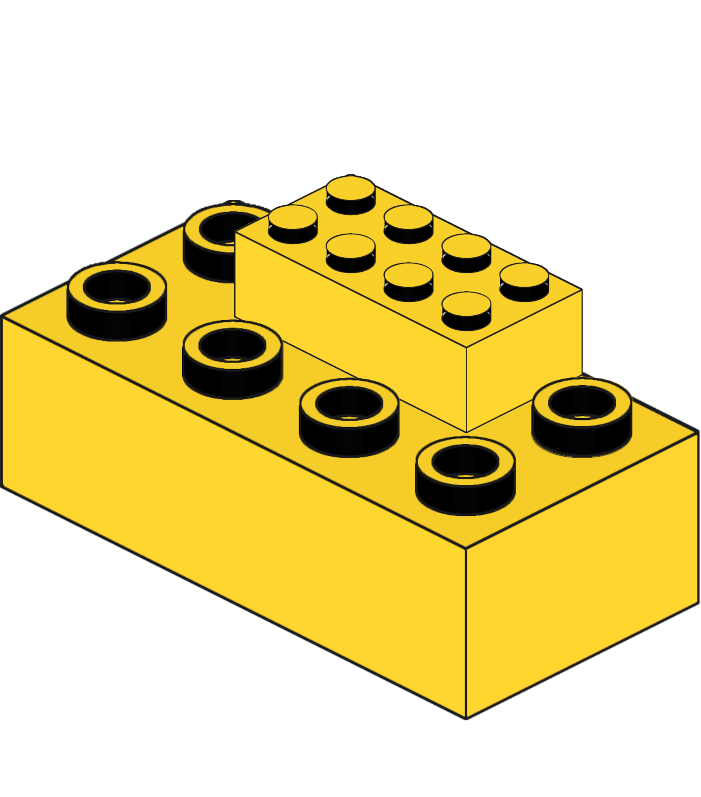
</div>

::right::

<div class="h-full flex flex-col justify-center gap-6">

<div v-click="1">

```js
// app.mjs
import foo from "./legacy.cjs"   // ✅
```

</div>

<div v-click="2">

```js
// app.cjs
const foo = require("./modern.mjs")   // ❌
```

</div>

</div>

<!-- import un module CJS a toujours marché parce que le système asynchrone peut supporter un import synchrone. C'est l'inverse qui est problématique, un module cjs ne peut pas require un module ESM parce que celui-ci a une exécution asynchrone -->

---
layout: two-cols-header
---

# {{ $page - 5 }} &nbsp;&nbsp;&nbsp; Top-level await

::left::

<div class="h-full flex flex-col justify-center items-center">
  
</div>

::right::

<div class="h-full relative">

<div v-click="1" class="absolute top-20 left-1/2 -translate-x-1/2 w-17/20">

```js
// config.mjs
const res = await fetch("/config.json");
export const config = await res.json();
```

</div>

<div v-click="2" class="absolute bottom-30 left-1/2 -translate-x-1/2 w-17/20">

```js
// app.mjs
import { config } from "./config.mjs";
// ⏳ attend la résolution de config.mjs
```

</div>

</div>

<!-- Exécution asynchrone d'un ES module = top-level await. Explication de top-level await, le module entier devient asynchrone et le module qui l'importe attend qu'il résolve (mais ça ne bloque pas les modules qui ne sont pas dépendants dans le graphe)-->

---

# {{ $page - 5 }} &nbsp;&nbsp;&nbsp; CJS reste le standard

<div class="h-full grid place-items-center">
  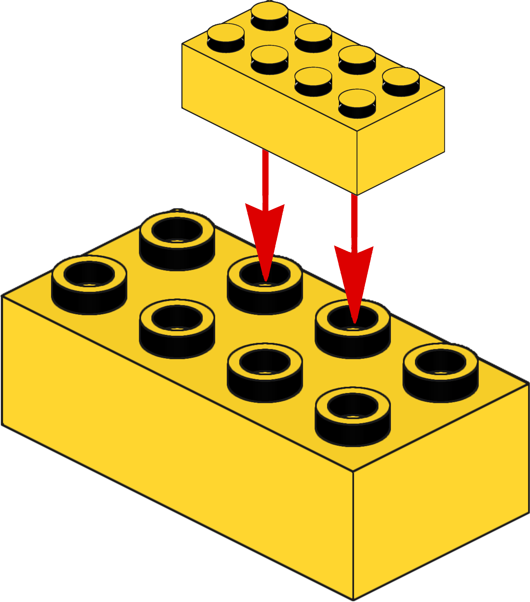
  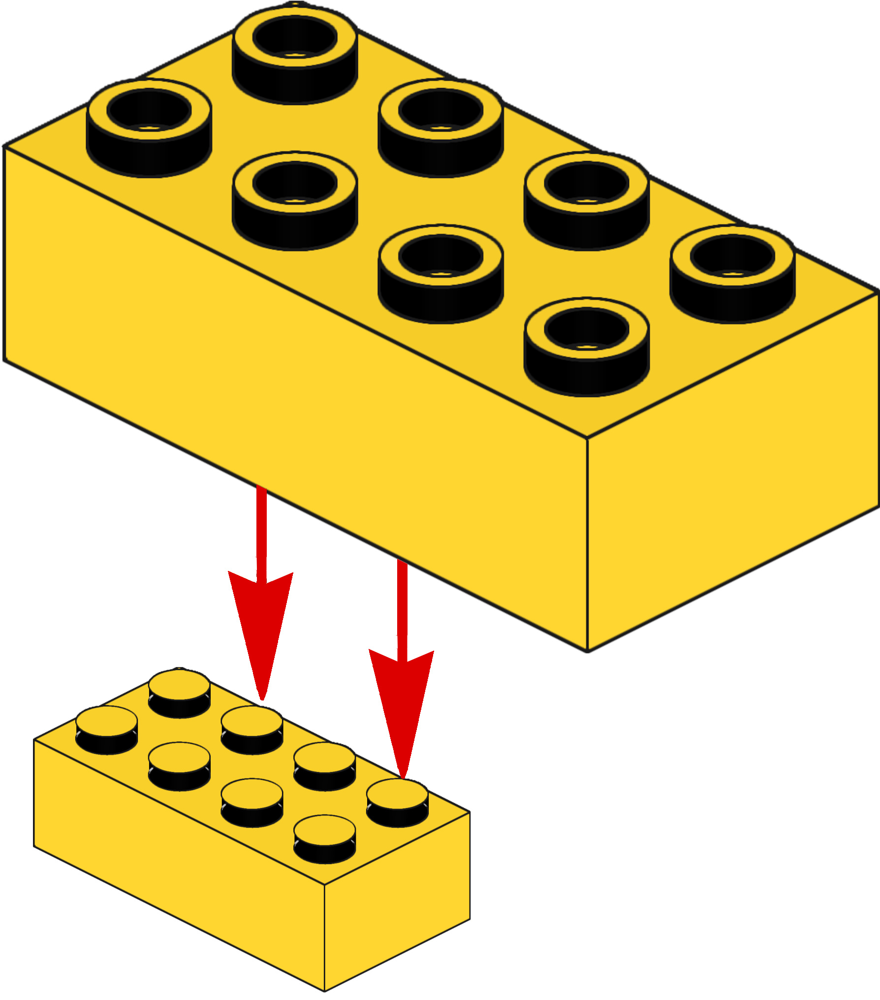
  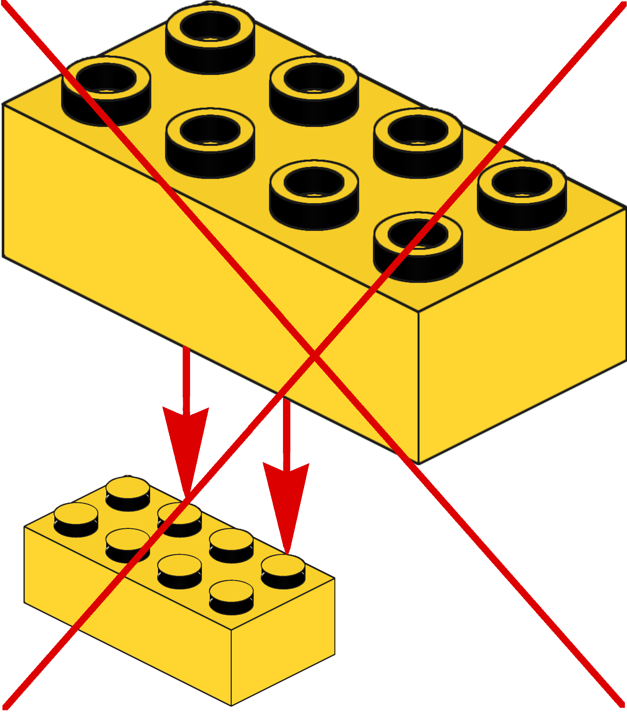
</div>

<!-- Conséquence : très difficile pour les auteurs de package de migrer en ESM-only parce que du coup les apps CJS ne peuvent plus les utiliser. Donc en fait il est très difficile pour l'écosystème de migrer progressivement, il faudrait que tout le monde migre d'un coup. Le plan à la base était que l'incompatibilité forcerait les consommateurs à migrer une fois que leurs dépendances ne livreraient plus de CJS. Mais le centre de gravité était plutôt côté cjs/consommateurs et l'écosystème s'est stabilisé sur le maintien du support CJS pour ne pas casser et ESM en bonus. -->

---
layout: two-cols-header
---

# {{ $page - 5 }} &nbsp;&nbsp;&nbsp; Packages en CJS et ESM

::left::

<div v-click class="h-full flex flex-col justify-center items-center gap-5">
  
  
</div>

::right::

<div class="h-full relative">

<div v-click="2" class="absolute inset-0 m-auto size-fit w-17/20">

```json
// package.json
{
  "exports": {
    "require": "./index.cjs",
    "import": "./index.mjs"
  }
}
```

</div>
</div>

<!--  Les auteurs de libraires exportent toujours du CJS et parfois de l'ESM en double format, mais jamais ESM-only. -->

---

# {{ $page - 5 }} &nbsp;&nbsp;&nbsp; Problème du double format

<div class="h-full grid place-items-center">
<div class="relative w-[430px] h-[400px] scale-[1.1]">

  <!-- le package, publié en deux formats -->
  <div class="absolute left-[60px] top-[0px] w-[110px] text-center text-xs text-gray-500">CJS</div>
  
  <div v-click="1" class="absolute left-[250px] top-[0px] w-[150px] text-center text-xs text-gray-500">ESM</div>
  

  <!-- les consommateurs -->
  
  
  

  <!-- les flèches de consommation -->
  <svg class="absolute inset-0 w-full h-full pointer-events-none text-gray-500" viewBox="0 0 430 400">
    <defs>
      <marker id="pkg-ah" markerWidth="8" markerHeight="8" refX="6" refY="3" orient="auto">
        <path d="M0,0 L6,3 L0,6 Z" fill="currentColor" />
      </marker>
    </defs>
    <line x1="57" y1="297" x2="115" y2="102" stroke="currentColor" stroke-width="2" marker-end="url(#pkg-ah)" />
    <line v-click.hide="1" x1="215" y1="297" x2="115" y2="102" stroke="currentColor" stroke-width="2" marker-end="url(#pkg-ah)" />
    <line v-click.hide="1" x1="372" y1="297" x2="115" y2="102" stroke="currentColor" stroke-width="2" marker-end="url(#pkg-ah)" />
    <line v-click="1" x1="215" y1="297" x2="325" y2="140" stroke="currentColor" stroke-width="2" marker-end="url(#pkg-ah)" />
    <line v-click="1" x1="372" y1="297" x2="325" y2="140" stroke="currentColor" stroke-width="2" marker-end="url(#pkg-ah)" />
  </svg>

</div>
</div>

<!-- Problème : les dépendences sont deux fois plus lourdes et surtout, ça peut casser silencieusement le principe de cache des modules (singleton). Certains paquets utilisent le cache des modules comme implémentation simple du pattern singleton (une seule instance de classe exportée, on tape toujours la même vu qu'un module n'est exécuté qu'une seule fois puis caché). Mais il se peut que dans la même app le package en CJS et en ESM soit importé donc il y a deux instances. -->

---
layout: two-cols-header
---

# {{ $page - 5 }} &nbsp;&nbsp;&nbsp; Faux ESM

::left::

<div class="h-full relative">

<div v-click="1" class="absolute top-20 left-1/2 -translate-x-1/2 w-18/20">

```js
// src/index.ts  (ESM)
import { foo } from "./foo"
export const bar = foo()
```

</div>

<div v-click="3" class="absolute bottom-20 left-1/2 -translate-x-1/2 w-18/20">

```js
// dist/index.js  (CJS !)
"use strict";
const { foo } = require("./foo");
exports.bar = foo();
```

</div>

</div>

::right::

<div class="h-full grid place-items-center">
  <div class="relative size-60">
    <div v-click="[2,3]" class="absolute inset-0 flex flex-col items-center justify-center gap-2">
      
      <div class="text-sm text-gray-500">ESM</div>
    </div>
    <div v-click="3" class="absolute inset-0 flex flex-col items-center justify-center gap-2">
      
      <div class="text-sm text-gray-500">CJS</div>
    </div>
  </div>
</div>

<!-- L'ESM est tellement pas un standard que la plupart des outils de build emettent du CJS par défaut, même si le code source est en ESM, afin de privilégier la compatibilité. On parle de faux ESM. C'est particulièrement source de confusion quand un développeur veut importer un module ESM dans son code et qu'il voit une erreur require(esm). Vu qu'il y a des solutions de contournement, ça devient encore plus difficile d'utiliser de l'ESM (transpilation, double formats) -->

---

# {{ $page - 5 }} &nbsp;&nbsp;&nbsp; L'ESM est-il vraiment asynchrone ?

<div class="h-full relative">

<div v-click="1" class="absolute inset-0 flex items-center justify-center pb-10">
  <div class="grid w-[920px] border border-black rounded-xl p-4" style="grid-template-columns: repeat(125, 1fr); gap: 2px;">
    <span v-for="i in 5000" :key="i"
      class="aspect-square rounded-full"
      :class="i === 1 && $clicks >= 3 ? 'bg-red-500' : i <= 6 && $clicks >= 2 ? 'bg-yellow-500' : 'bg-gray-400/30'"></span>
  </div>
</div>

<div v-click="1" class="absolute bottom-20 right-0 text-center text-xs text-gray-500">
  Données : Joyee Cheung
</div>

<span v-click="2" /><span v-click="3" />

</div>

<!-- En fait, l'ESM est OPTIONELLEMENT asynchrone. Si le module n'a pas de top-level await, l'évaluation est synchrone, ça change tout ! Il est donc possible de require un esm de manière synchrone sans problème. Intéressant que la communauté nodejs ait mis au moins 5 ans à voir ça. Sur les 5000 packages les plus influents, 6 seulement utilisent du top-level await, et 5 sur 6 peuvent utiliser autre chose. Le dernier est dans du code minifié donc c'est pas clair. En fait top-level await c'est du code applicatif mais pas de package, très peu de chances de le croiser dans une dépendance -->

---
layout: two-cols-header
---

# {{ $page - 5 }} &nbsp;&nbsp;&nbsp; Compatibilité bidirectionnelle

::left::

<div class="h-full grid place-items-center">

</div>

::right::

<div class="h-full relative">

<div v-click="1" class="absolute inset-0 m-auto size-fit w-17/20">

```js
// app.cjs
const { render } = require("./app.mjs"); // ✅
```

</div>

</div>

<!-- Début 2026 le support de require(esm) est arrivé dans node (pas expérimental), donc on peut s'attendre à ce que les packages fassent de plus en plus d'ESM -->

---

# {{ $page - 5 }} &nbsp;&nbsp;&nbsp; Evolution de l'écosystème ?

<div v-click class="h-full grid place-items-center -mt-5">

</div>

---

# {{ $page - 5 }} &nbsp;&nbsp;&nbsp; Conclusion

<div class="absolute inset-0 w-full flex justify-evenly items-center">
  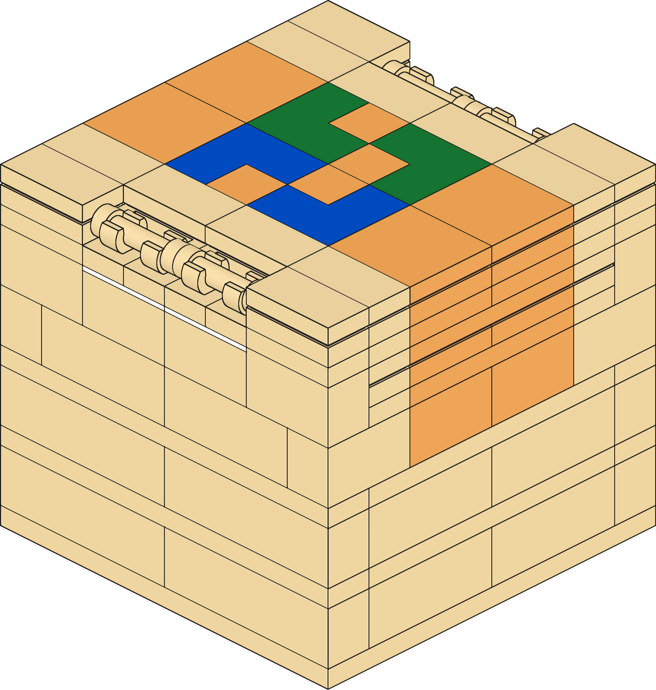
  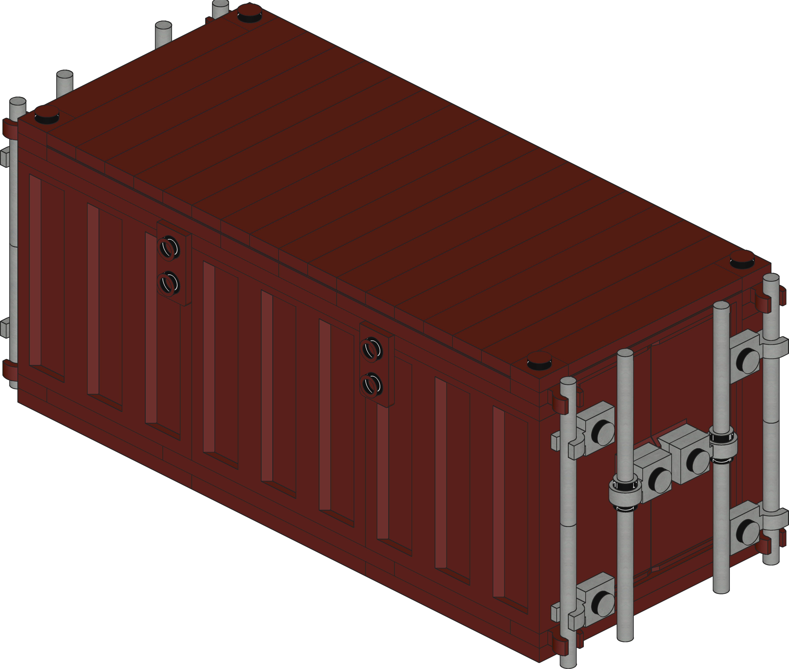
</div>

<!-- TODO Mention des nodisms pour le CJS (bare imports, pas d'extension)-->

<!-- Recap: 
* Pourquoi on a besoin d'un système de modules
* Pourquoi on a deux systèmes de modules
* Comment ils fonctionnent et quelles sont leurs différences fondamentales
* Pourquoi le CJS existe encore

On espère que cette conf va devenir inutile, l'ESM est le format moderne et il y a de moins en moins d'excuses pour en faire de partout et arriver à un ecosystème full-ESM.  -->

---

<div class="flex justify-evenly items-center h-full">
  
  <div class="flex flex-col items-center gap-2">
    <div class="text-3xl font-bold">Théo Gianella</div>
    <div class="text-xl">Développeur web</div>
    
  </div>
</div>


